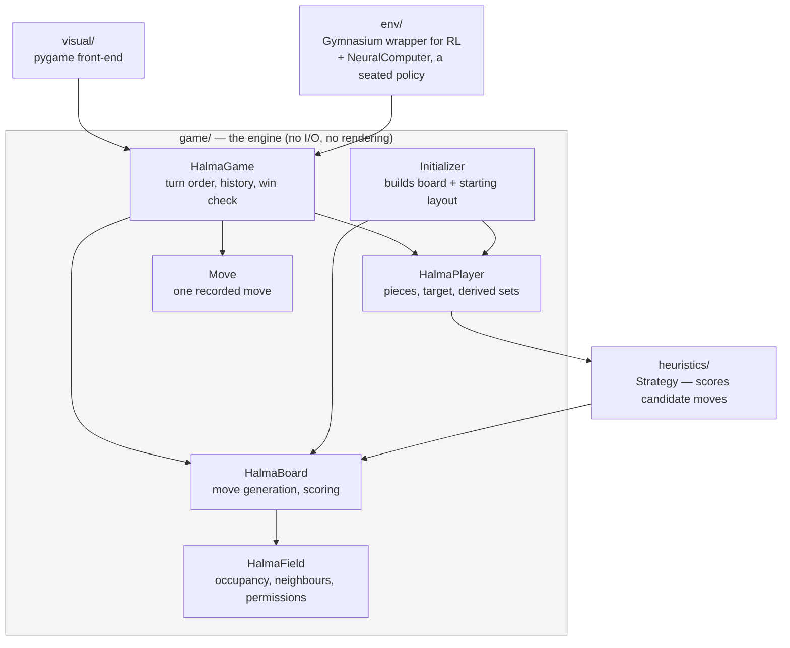

# Architecture

How this codebase is put together and why. `README.md` covers what the project
is and how to run it; this file explains the internals. `CLAUDE.md` holds the
day-to-day conventions for working in the repo and points here for structure.

---

## The shape of the system

The game engine is pure Python and knows nothing about pygame, numpy-heavy
tensors or reinforcement learning. Everything else is a consumer of it.



The single most important consequence: **changing engine behaviour affects three
consumers**, and only one of them (`visual/`) is something you can see. Check
`heuristics/`, `visual/` and `env/` when you touch `game/`.

The consumers stay unaware of each other; `visual/` does not import `env/`. Where
the two meet — a human playing a trained policy — it is a script that wires them
together (`scripts/playAgainstAgent.py`), because `env.NeuralComputer` is just a
`HalmaPlayer` and the front-end cannot tell it from a heuristic bot.

---

## The board

121 fields forming a six-pointed star (Chinese-Checkers style). Each field has
up to six neighbours — two at the star's tips.

`Initializer.buildFields` builds it as a **9×9 rhombus (81 fields) plus four
ten-field triangles (40)**. Note that this construction does *not* line up with
the six home regions, which is the confusing part:

- Up to three players, **15 pieces each** — a triangle of 1+2+3+4+5.
- For players 1 and 2 that home region **straddles the seam**: 10 fields come
  from an explicitly built triangle, the remaining 5 from the rhombus's edge
  row (`(i, -4)` and `(-4, i)` respectively).
- Player 3's home region lies **entirely inside a corner of the rhombus**
  (`(4-j, i)`), with no explicit triangle at all — which is why its coordinates
  look unlike the other two.

So "the four triangles" are a construction detail of the geometry, not the
players' home bases. A player's target is the star point opposite their start.

### Three ways to address a field

This is the main source of confusion in the codebase. A field carries the first
two; `HalmaBoard` converts between them.

| Name | Form | Used for |
|---|---|---|
| `coord` | axial hex `(x, y)` | geometry: distance, rotation, flipping, drawing, and finding the field a jump passed over |
| `id` | `0`–`120` | **everything else**: `board.fields[id]`, player positions, moves, RL actions |
| `fieldNumber` | `(x+8) + (y+8)*17` | build-time only — lets `initEdges` find neighbours by offset arithmetic on a 17×17 grid |

`fieldNumber` is pure scaffolding and does not exist outside `Initializer`: it
is derived from `coord` where adjacency is being wired and is deliberately not
stored on the field, because nothing after construction has a use for it. New
code should not reintroduce it.

`coord`, by contrast, is *not* build-time only — a common assumption worth
correcting. Rendering, click hit-testing, the distance matrix, the RL symmetry
permutations and `Move`'s jumped-over calculation all need it while the game is
being played.

The three are tied together by one rule worth knowing: **a field's `id` is its
rank in `fieldNumber` order**. `Initializer.buildFields` builds the fields in
that order, so the id is just the index — the "fields must be ordered by id"
contract on `setFields` is satisfied by construction rather than by a later
sort. That in turn makes `board.coordFromId(id)` a plain `fields[id].coord`
with no lookup, and only the reverse direction needs an index
(`board.idFromCoord`, built once in `setFields`).

The board owns that index because it is board data. `Initializer` keeps no
state at all: it builds fields and hands them over, and when it later needs a
coordinate translated — placing the players' starting layout — it asks the
board, the same way `initEdges` and `initPermissions` already take the board as
a parameter. The dependency only ever points from initializer to board.

### Field permissions

`Initializer.initPermissions` marks a field as exclusive to one player when
*every* neighbour of that field is also in that player's own start/end set —
i.e. the interior of their home triangles. All other fields are open to
everyone. This is what stops a player from parking a piece in someone else's
target and blocking them out forever.

---

## Moves: two representations

A move is a sequence of field `id`s, but it exists in **two forms**, and picking
the wrong one is an easy mistake:

- **Endpoints only** — `(start, end)`. Produced by `board.allValidMoves`. This
  is what the RL env and the scoring heuristics use.
- **Full path** — `[start, land, land, ..., end]`. Produced by
  `board.allValidMovesWithWay`. The visualization needs it to draw a multi-hop
  jump, and `Move` needs it to know the intermediate landings.

`game/boardTypes.py` names both (`MoveEndpoints` = `tuple`, `MovePath` =
`list`), so the distinction is checkable by the editor and not just described
here. The same file names `FieldId`, `Coord` and `PlayerId`.

`PlayerId` is an `int` — a seat number, 1 to 3. Never a name, and never 0,
because 0 is what an empty `HalmaField` holds. `board.boardState()` collects
those ids into a numpy array that the RL layer does arithmetic on, so a string
identifier would turn it into a string array in which every empty field
compares unequal to 0 and reads as an opponent's piece. Whether a player is
human is answered by `isHuman()`, not by their identifier.

There is **one** generator, not two: `allValidMovesWithWay` runs the BFS over
chained jumps, and `allValidMoves` is its endpoints view. A single step goes to
an empty neighbour; a jump hops over an occupied field onto the empty one
directly beyond, and jumps chain. Only the piece's own field is queued, so a
step is never chained into a jump.

`Move` stores whatever it was given. If it only got endpoints,
`reconstructFullMove` recovers the path by BFS and records the jumped-over
fields — see the invariant on `jumpedOvers` below.

---

## Layer by layer

### `game/` — the engine

`HalmaGame` owns the board, the players, the turn order and the move history,
and decides who has won. `ComputedGame` (all bots) and `InteractiveGame` (one
human) differ *only* in which players they seat; all behaviour lives in the base
class.

Turn order is randomised once at setup (`computePlayersOrder`) and then rotates
by move count — `currentPlayer()` is derived from `len(self.moves)`, not stored.
That is what makes stepping backwards through history work without extra
bookkeeping.

A player wins by filling their target base, **or** when their target base is
completely full including opponent pieces (`playerIsWinningByBlockedFields`) —
otherwise a single squatter could deadlock the game forever.

`HalmaBoard` does double duty: move generation *and* the heuristic scoring
functions the bots rank positions with (`simpleDistanceScore`,
`advancedDistanceScore`, `sparsityScore`, `playerSparsityScore`,
`potentialJumpScore`, `homeBonusScore`, `bottleneckScore`). For all of them
**lower is better**.

### `heuristics/` — the bots

`Strategy.SCORERS` maps a strategy name to the method implementing it and is
the single source of truth for which strategies exist — construction validates
against it and `scripts/baseline.py` enumerates `STRATEGY_NAMES`, so no second
list can drift. `bestMove` evaluates every candidate by **applying it to the
real board, scoring, then reversing it**, and picks a minimum at random among
ties.

Two findings are worth recording, because both cost real time to establish and
would otherwise be rediscovered the expensive way:

- **Opponent-awareness cannot help at one ply.** An opponent's distance and
  home-bonus terms are *identical* across all of the mover's candidates — the
  opposition does not move while you evaluate your own options — so subtracting
  them shifts every candidate equally and cannot change which move wins.
  Measured: one distinct value across 72 candidates. It only pays inside a
  search, where the replies differ, which is what `LookaheadStrategy` is for.
- **Rewarding long available jump chains makes the bot worse**, badly: 8.8% and
  0.0% win rates against `advancedDistScore` at two weights. Preferring
  positions that *have* long chains keeps pieces hoarding jump potential
  instead of advancing.

What does work is `bottleneckScore`: the distance still facing the piece left
furthest behind. The game ends only when every piece is home, so the sum of
distances is the wrong late objective — it collapses while one straggler
decides the length of the game. Adding it to `advancedDist` wins 84% (±5.9 over
150 games) against plain `advancedDist`, robust across weights from 0.02 to 1.0.

Strength order, all measured: `lookahead2` > `bottleneck` > `advancedDistScore`
> `simpleDistScore` > `sparsityScore` >> `random`. `InteractiveGame` seats the
strongest; `ComputedGame` keeps the cheap one-ply bots because it feeds the RL
environment, where a two-ply search at ~130ms a move is out of the question.

Seats confer no advantage, which is what makes `scripts/baseline.py` readable:
in 400 mirror games seat 1 won 47.8% (±4.9) and the player on move 53.5%
(±4.9) — both consistent with an even game.

The mutation is scoped by `board.moveApplied(move, player)`, a context manager
that undoes the move in a `finally`. Copying the board per candidate would be
far more expensive, and the undo is exact — see the invariants. The consequence
to keep in mind is that scoring is *not* read-only: a board can only be scored
by one caller at a time, so candidate moves for a single position cannot be
evaluated in parallel. Running several independent games at once is unaffected,
since each has its own board.

### `visual/` — the pygame front-end

`GameVisualization` is the orchestrator and owns the main loop. It holds no
drawing logic itself; it wires up four single-purpose collaborators:

- **`BoardProjector`** — the only thing that knows about screen geometry and
  the current rotation. Both drawing and click hit-testing go through its
  `coordToPos`/`posToCoord` tables, so a rotated board projects and un-projects
  consistently.
- **`BoardRenderer`** — draws; holds no state of its own.
- **`GamePlaybackController`** — owns the history cursor `moveTraveler` and
  steps the board forwards/backwards by applying and un-applying recorded moves.
- **`HumanInputHandler`** — turns a pair of clicks into a validated move.

The bot only auto-plays when the cursor is at the live front of the game
(`moveTraveler == len(game.moves)`), so reviewing history does not trigger new
moves.

### `env/` — the RL wrapper

`HalmaEnv` wraps a `ComputedGame` as a Gymnasium environment. Actions are
encoded as `start * fieldCount + end`.

`env/neuralPlayer.py`'s `NeuralComputer` is the other consumer of that
encoding: a `HalmaPlayer` backed by a `MaskablePPO` checkpoint, so a trained
policy can be seated like any bot (`scripts/playAgainstAgent.py` does this
against `visual/`). It keeps a `HalmaEnv` purely as an encoder and repoints it
at whatever game is actually being played (`attachTo`) rather than
reconstructing the observation by hand — one implementation of the encoding,
used both to train and to play. That is also why `HalmaEnv.game` is typed as
the `HalmaGame` base class rather than `ComputedGame`: only the base API is
used, which is what lets the same encoder sit on an `InteractiveGame` too.

`HalmaEnv` takes a `selfSeat` (default `AGENT_SEAT`), and a `NeuralComputer`
passes its own identifier through, so its encoder builds the observation from
whichever seat it actually occupies. Training only ever uses seat 1, but this
is what lets two checkpoints play each other (`scripts/compareCheckpoints.py`)
instead of each only being measurable against a common panel of bots. The
constructor still refuses any seat but `AGENT_SEAT`/`OPPONENT_SEAT` — the
normalizer has no permutation for a third.

Gymnasium models one agent against a world; Halma has two players. So the agent
owns one seat and the heuristic opponent moves *inside* `step` — one env step is
a full round. Only ~65 of 14641 encoded actions are legal at a time, so
`action_masks()` is not optional: without it the policy would spend itself
learning which actions are illegal rather than which are good.

`opponentStrategy` takes either one bot name or a sequence of them. A sequence
is a pool: `reset()` draws one at random (from the seeded `np_random`, so the
draw is reproducible) and that is who the agent faces for the whole episode.
This exists because PPO fine-tuning against a single fixed bot sharpens
against *that* bot specifically: the agent fine-tuned to 99% against
`advancedDistScore` falls to 90–92% against random, weaker than the clone it
started from (96%), which never trained against a fixed opponent at all —
`scripts/pretrain.py` fits it to a bot's move choices by cross-entropy rather
than playing against it. Training against a pool is the fix under test:
`scripts/train.py --opponentPool` accepts several names, while `--opponent`
still names the one bot progress reports and final results are measured
against, whether or not it is in the pool.

`opponentModel` seats a frozen checkpoint as the opponent instead of a
heuristic — a `NeuralComputer` built once in `__init__` and reused every
episode via `attachTo`, the same reuse `scripts/compareCheckpoints.py` relies
on, rather than reloaded from disk each reset. It takes priority over
`opponentStrategy`/`opponentPool` when given. `env/neuralPlayer.py` imports
`HalmaEnv` itself, so `HalmaEnv` cannot import `NeuralComputer` at module
level without a cycle; the import is deferred to inside `__init__`, the usual
fix for a two-module cycle like this one. This is a fixed sparring partner,
not self-play — the opponent's weights never move, only the trained side's
do. `scripts/train.py --opponentModel PATH` wires it up, threading through
progress reports and the before/after evaluation the same way a heuristic
opponent would. True self-play — the opponent kept in step with training
rather than frozen — is still unbuilt.

`opponentModelPool` extends `opponentPool`'s per-episode draw to frozen
checkpoints as well as heuristics: `reset()` draws from the combined pool
(skipped, like `opponentPool`'s own draw, whenever `opponentModel` has pinned
a single fixed opponent), so one run can mix heuristic and tuned-model
opponents rather than being limited to one or the other. Every checkpoint in
the pool is loaded once in `__init__`, same reasoning as `opponentModel`.
`scripts/train.py --opponentModelPool PATH [PATH ...]` wires it up; the
periodic progress-report callback prints one win-rate column per candidate in
that case — `--opponent` plus one column per tuned checkpoint — rather than
just the single number a fixed-opponent run tracks.

`opponentStrategy` may also be **empty**, which is the one case where no
heuristic is ever drawn: the combined pool is then the checkpoints alone. It
needs `opponentModel` or a non-empty `opponentModelPool` to supply an opponent
at all, and `__init__` raises if neither is there, because `_seatPlayers()`
runs before the first `reset()` and would otherwise have nothing to seat. This
exists because the heuristic pool could not previously be emptied from the
command line — `--opponent` always seeded it, so a nominally checkpoint-only
run still faced a bot on roughly one episode in *n+1*.
`scripts/train.py --noHeuristicOpponents` is the flag.

Note what this is and is not: a pool of frozen past checkpoints is league play,
not true self-play, and the distinction is the same one drawn for
`opponentModel` above — every checkpoint's weights stay fixed for the whole
run. Emptying the heuristic pool changes *who* is in the league, not whether
the opponent tracks the learner.

`boardNormalizer.Normalizer` precomputes field-id permutations for each player's
viewpoint (`player1WithFlip`, `player2WithoutFlip`, … plus inverses) that map
any player/orientation into one canonical frame, so a single policy learns one
orientation rather than several.

The `player2...` permutations sat unused until `selfSeat` gave them a caller —
nothing had ever built an observation from seat 2 before — and unused turned
out to mean wrong. The three home corners sit 120 degrees apart in the order
player1 → player3 → player2, not player1 → player2 → player3, so
`player2WithoutFlip` was rotating the board onto **player 3's** corner. Fixed
by rotating 240 degrees instead, and `player2WithFlip` re-derived the same way
rather than patched: `rot300` composed with the Y-axis flip, verified against
an independently-derived coordinate transform on all 121 fields, not just the
subset that happened to look self-consistent. See invariant 7 below for the
second bug this same work found, which is the one that actually cost games.

**The reward is shaped, and it has to be.** Winning is the only true reward and
it arrives once per ~69 decisions — and a random agent, measured over 700 games,
never wins at all. A constant signal teaches nothing, so `_shaping` adds
`weight * (gamma * phi(s') - phi(s))` on every step. This is the potential-based
form (Ng, Harada & Russell 1999) whose terms telescope, so it changes no policy's
ranking — the agent is hurried, not redirected. Verified over 32 completed games:
the discounted return shifts by exactly `-phi(s0)`, to machine precision. Two
conditions: `gamma` must match the training discount, and the potential is zeroed
on termination but deliberately *not* on time-limit truncation, where the agent
should still bootstrap. Set `shapingWeight=0` to turn it off and measure whether
it earns its place. `info["outcome"]` carries the unshaped ±1 so evaluation
scores wins rather than shaping.

The potential is **the agent's own remaining travel**, normalised: the sum, over
its pieces, of the distance from each to the nearest field of its target zone,
divided by the 140 steps facing it at the opening and subtracted from 1. So it
runs 0 at the opening to exactly 1 once every piece is home — and, with 15 pieces
and 15 target fields, a remaining travel of zero *is* the win condition, so the
top of the scale coincides with winning rather than approximating it.

Two things it is deliberately not:

- **Not the lead over the opponent.** A lead can be held by obstructing as
  easily as by advancing, and an agent trained on the difference took exactly
  that route — it finished with none of its 15 pieces home while holding the
  opponent from 14 down to 12.
- **Not the bots' `advancedDistanceScore + homeBonusScore`.** That is what
  `heuristics/` ranks moves by, and it is a poor thing to shape with. Two thirds
  of it is `simpleDistanceScore`, the distance to the single *tip* field of the
  target triangle rather than to the triangle: measured over 235 moves it moved
  ten times further per move than the zone-distance term, so it was effectively
  the whole signal, and it aimed at one corner. It also never bottoms out — a won
  position still scored 1.25 against the opening's 7.69, leaving 16% of the
  shaping budget unreachable and paying pieces already home to shuffle towards
  the tip. Its distance term is averaged over the pieces still out, too, so a
  piece arriving shrank the numerator and the divisor together.

Nearest target field per piece, rather than a min-cost assignment of pieces to
target fields. The assignment is the exact remaining travel, but the two
correlate at 0.996 over real games and agree on which moves help, so it is not
worth an O(n³) matching — or a scipy dependency — on every step.

---

## Invariants you must not break

These are load-bearing and mostly non-obvious. Each is pinned by a test.

**1. `player.distanceScore` is maintained incrementally.**
`board.updatePlayerDistanceScore` adjusts only the terms that changed rather
than recomputing over all pieces. Two properties depend on it and are verified
in `tests/test_scores.py`: applying a move and then its reverse restores the
score exactly, and the incremental value matches a full recomputation. Both
`Strategy.bestMove` and `GamePlaybackController.backwardGame` rely on this.

**2. Reversing a move is a true undo.**
`applyMoveForPlayer((end, start), player)` must restore the board *and* the
player's derived sets (`positions`, `nonArrived`, `openEndPositions`). Playback
and bot search both depend on it.

**3. `Move.jumpedOvers is None` means "not reconstructed yet".**
It must **not** be initialised to `[]` — `needsReconstruction()` reports on
exactly that `None`, so an empty list would make every move look already
reconstructed. `fullStepsList()` raises a `RuntimeError` if called first.

**4. Reversing nests correctly across players.**
`LookaheadStrategy` applies its own move and then the opponent's reply inside
it. Each `moveApplied` block undoes exactly its own move and they unwind in
order, so both players' `positions`, `nonArrived`, `openEndPositions` and
`distanceScore` come back unchanged. Pinned in `tests/test_strategy.py`.

**5. Derived player sets are updated on every move.**
`nonArrived` and `openEndPositions` are kept in sync by
`updatePositionWithMove` so the heuristics never have to recompute them. Code
that moves pieces by writing `field.playerID` directly (as some tests do
deliberately) bypasses this and leaves the player object stale.

**6. `gameLength()` is the position's version, and `HalmaEnv` caches on it.**
Every real move goes through `playMove`, which appends to the move list, and
`currentPlayer()` is derived from that count — so the move count identifies the
position within an episode. `HalmaEnv._legalActions` memoises on it, because
generating moves is the most expensive thing the environment does and one step
used to ask five times over (the caller's `action_masks()`, `step`'s legality
check, the opponent's search, the mobility scalar, and `action_masks()` again
inside `_info`) for what are only two distinct positions. Scoring a candidate
does *not* bump the count — `moveApplied` goes straight to the board — which is
sound only because scoring never calls `_legalActions`. Hand-placing pieces
does not bump it either, so tests that do that must not then read the mask.
`reset` clears the entry, since a new game restarts the count.

**7. `HalmaEnv._needsFlip` keys on a seat's fixed home corner, not its current
pieces.** It picks between two mirror-symmetric but equally valid canonical
frames, and both are correct in isolation — the mistake this guards against is
subtler than choosing the wrong one. Keying on *current* piece positions makes
the choice a function of where those pieces have wandered to, and a seat whose
pieces cross the sign threshold mid-game (seat 2's do; seat 1's never do in
practice, confirmed over 200 seeds) gets the canonical frame swapped out from
under it almost every ply once its pieces straddle that line — a discontinuity
training never produces, because it only ever trains seat 1, whose frame
never moves. The cost was not cosmetic: a checkpoint at 99% against a heuristic
from seat 1 lost 20/20 from seat 2, and 0/20 in self-play against its own
seat-1 copy, while every other property of the encoding — the permutation math,
byte-identical observations at the opening, move legality, per-move progress —
checked out. Keying on `startPositions` instead (fixed for the whole game)
recovered both: self-play went to a roughly even 17/13, seat 2 against the
heuristic to 29/30. Pinned in `tests/test_env.py` by moving a player's current
pieces to the far side of the board without touching `startPositions` and
asserting the flip choice does not follow them.

**8. A reused player object must not carry positions between games.**
`prepareForGameStart` resets `positions` from `startPositions` rather than
unioning into it, precisely so a player object seated in a second game does
not keep whatever pieces it had not yet gotten home in the first. Every
caller in `game/` and `heuristics/` constructs a fresh player per game and
never needed this; `scripts/compareCheckpoints.py` reuses the same
`NeuralComputer` across many games specifically to avoid reloading a
checkpoint from disk each time, and hit it immediately — `board.py` reads
`player.positions` directly to generate moves, so a stale union proposed
moves from fields the fresh board had never placed a piece on, and applying
one corrupted the board outright. Pinned in `tests/test_game_setup.py` by
reseating the same two player objects across two games and checking
`positions` resets rather than leaks.

---

## How a move actually happens

**A bot move**

```
HalmaGame.playNextMove(player)
  └─ getNextMove          → board.allValidMovesWithWay(player)   (full paths)
       └─ player.chooseMove → Strategy.bestMove
            └─ for each candidate: apply → score → reverse
  └─ playMove             → board.applyMoveForPlayer  (moves piece, updates
                             player sets + distanceScore)
                          → append Move to history
```

**A human move**

Click a piece, then a destination. `HumanInputHandler` collects the two clicks,
validates the pair against `allValidMovesWithWay`, plays it through the same
`playMove`, and advances the playback cursor so rendering stays in sync.

**Stepping through history**

`GamePlaybackController` replays or un-applies recorded moves on the *live*
board — there are no board snapshots. `gameStateAt(n)` rewinds to the start and
replays `n` moves.

---

## Design decisions worth knowing

**camelCase throughout.** Un-pythonic but consistent. Ruff's `N` rules are
deliberately disabled (`ruff.toml`) because enabling them reports ~300
violations and would invite a rename touching every file for no functional gain.
Match the surrounding style in new code.

**The engine never prints.** `HalmaGame.play()` returns the winner's identifier
(or `None` on a draw by exhaustion) instead of writing to stdout, because
self-play training runs it thousands of times. `printBoard()` is the one
deliberate exception — printing is its purpose.

**Distances are precomputed.** `calculateDistanceMatrix` fills a 121×121 table
once at setup so the heuristics can look up any pair in O(1).

**Board dimensions are derived, never hardcoded.** The field count comes from
`len(board.fields)` and the piece count from `len(player.positions)` /
`len(player.endPositions)`, including in the RL action encoding
(`HalmaEnv.fieldCount`). The numbers 121 and 15 should not appear as literals.

---

## Current state

| Area | State |
|---|---|
| `game/` | Refactored, documented, characterization-tested |
| `heuristics/` | Working; five bots, strength measured against each other |
| `visual/` | Working; refactored into focused modules. No tests |
| `env/` | Satisfies the Gymnasium API, masked and shaped; trained policies playable via `NeuralComputer` |
| Agent | Cloned from a bot, then fine-tuned by PPO to 99% against `advancedDistScore` |

`env/` passes `gymnasium.utils.env_checker.check_env` and has action masking, a
canonical observation and reproducible seeding.

`scripts/baseline.py` plays every pairing of the bots and is the yardstick a
trained agent has to clear. The number that shaped the plan: **a random agent
wins none of 700 games**, so an untrained policy sees the same reward in
essentially every episode. That is why shaping came before training.

**Shaping was not enough on its own.** With the reward shaped, the geometry
given to a CNN and the action head factored, PPO from scratch still ended a
quarter hour of training at 0 wins and single-digit percent of pieces home. The
signal is there, but the region of policy space where Halma is played is not
somewhere random exploration arrives.

**What worked was copying a bot first.** `scripts/pretrain.py` plays games with
`bottleneck` on the agent's seat, records its choice in every position, and fits
the policy to those choices by cross-entropy over the masked distribution. On
150k positions and 12 epochs the policy agrees with the bot on 73% of positions
and goes from 0% wins to 86% against `advancedDistScore` (argmax, 50 games).
Scored over the same games, the teacher itself takes 68% — but it wins 64% against
`sparsityScore` where the clone takes 54%, so the clone is at roughly teacher
strength and specialised to the opponent its data was collected against, not
generally stronger. `scripts/train.py --init` fine-tunes from that checkpoint.

Mixing the bot into PPO's *own* rollouts — playing the bot's move some fraction
of the time — is the obvious-looking alternative and does not work:
`collect_rollouts` stores the log-probability of the action the policy sampled,
and the update forms `exp(log_prob - old_log_prob)` against it, so a substituted
action leaves the ratio comparing the wrong pair of distributions and nothing
raises. Mixing during *collection* is a real method (DAgger) but its labels come
from the expert and its loss is the supervised one; `pretrain.py --mix --rounds`
implements that form.

**PPO on top of the clone clears its teacher.** 300k steps from `models/cloned`
take it from 82% to **99% against `advancedDistScore`** (198W 2L of 200 games,
argmax; 97.5% sampled), with the fine-tuned agent also finishing games in 50
steps against the clone's 60. The margins do not overlap, so this is the answer
to the question the shaping and speed work was in service of: reinforcement
learning does add something here, once it starts somewhere it can learn from.

Two things that measurement also settled. The entropy coefficient, set to 0.01
so a from-noise policy would not collapse, turned out not to matter on a cloned
one: 0.001 and 0 land at 99.0% and 99.5%, indistinguishable. What does matter is
step size. At sb3's default learning rate `approx_kl` ran 0.06-0.37 against a
healthy ~0.01 and `clip_fraction` 0.2-0.37, and both runs were thrown back
repeatedly along the way — one from 90% to 40% and back within 50k steps. A
policy that starts sharp needs smaller steps than one that starts diffuse;
`--lr` and `--targetKl` exist for that and the default is still the from-noise
one.

The agent is also **specialised to the opponent it trained against**: 99%
against `advancedDistScore` but 90-92% against `random`, where the clone was at
96%. Beating one bot decisively is not the same as playing Halma well, so the
measurement worth having was against opponents it never saw.

Measured, 30 games against each of four bots (argmax), mean win rate last:

| checkpoint | advancedDist | bottleneck | sparsity | random | mean |
|---|---|---|---|---|---|
| `cloned` | 80.0 | 46.7 | 60.0 | **96.7** | 70.8 |
| `tunedEnt000` | **100.0** | 90.0 | 76.7 | 86.7 | **88.3** |
| `tunedEnt001` | 96.7 | 90.0 | 76.7 | 90.0 | **88.3** |

At ±11 to ±18 on each cell, only the gaps between the clone and the tuned pair
mean anything. Those say the specialisation is **narrower than it looked**: the
clone is ahead only against `random`, and fine-tuning nearly doubles the score
against `bottleneck` — the strongest one-ply bot, which neither checkpoint ever
trained on. So PPO on top of the clone did not merely sharpen it against
`advancedDistScore`; what it lost is ground against the weakest opponent, where
the shortest path to a win is least like anything a bot would play. The two
tuned checkpoints are indistinguishable, which is the entropy finding again.

The comparison goes through a common panel of bots because that is what answers
the question. Each cell is an absolute number against a fixed opponent — and for
three of the four, one no checkpoint ever trained on — so a column is a yardstick
rather than a relative ordering, and all three checkpoints are measurable on it
at once. A head-to-head result says only which of two policies is ahead, and says
it against an opponent that moves as training does.

75k further steps on `bottleneck` — a heuristic the agent had only ever seen
baked into `cloned`'s imitation data, never as a PPO opponent — pushed
`tunedOnBottleneck` past `tunedEnt000` on every one of those four bots except
`lookahead2` (46% argmax), the one bot none of this lineage has ever trained
against: 100% on `advancedDistScore` and `sparsityScore`, 96% on `bottleneck`
itself, 90% on `random`.

Head-to-head is also available now (`scripts/compareCheckpoints.py`, using
`selfSeat`), and building it is what found invariant 7 above: the first
round-robin looked like a bug report rather than a result — seat 1 won every
matchup and seat 2 never won once, regardless of which checkpoint sat where.
The `_needsFlip` fix resolved it; a rerun stopped being seat-biased (draws
went from many, seat 2 repeatedly timing out at the move cap, to zero) and
produced a real ranking. Grown since to eleven checkpoints, every pairing, 30
games at seed 0:

| checkpoint | record |
|---|---|
| `multiVsModel` | 8-2 |
| `tunedEnt000` | 7-3 |
| `pooledFinetuned` | 7-3 |
| `pooledWithLookahead` | 7-3 |
| `tunedEnt001` | 6-4 |
| `multiTeacherTuned` | 5-5 |
| `cloned` | 5-5 |
| `tunedOnBottleneck` | 4-6 |
| `multiTuned` | 4-6 |
| `clone_from_multi` | 2-8 |
| `maskedPPO` | 0-10 |

Single-seed argmax, so treat this as directional rather than a tight
estimate — most matchups were 100/0 or close, a few near-even at 56.7%. Those
near-even numbers have since been explained, and they were not close matches:
under argmax the opening is fixed and both policies are deterministic, so the
seed varies only the play order and a pairing has exactly **two** possible
games, whichever `--games` says. 56.7% is 17/30, the share of those seeds that
let seat 1 start — i.e. the first mover won every game and the two policies
were indistinguishable. The non-transitivity below is the same artefact: about
one bit per matchup, reported with an interval that assumed `--games`
independent samples. `compareCheckpoints.py` now plays every pairing in both
seat directions, and in argmax mode reports the winner per play order instead
of a percentage; `--sampled` is what yields a real win rate (the same 20 seeds
give 17 distinct games). The ranking above predates that and is kept as it was
measured.

The non-transitivity (`pooledWithLookahead` beats `tunedEnt000`, `tunedEnt000`
beats `tunedOnBottleneck`, `tunedOnBottleneck` beats `pooledWithLookahead`) is
therefore mostly measurement noise here, though genuine non-transitivity is
also expected for adversarial policies trained by different processes. `maskedPPO` and `maskedPPO_300k`
predate later architecture changes; the latter now loads but its observation
space no longer matches (`Box(246,)` against the current `Dict`) and is excluded,
the former loads and plays but is the oldest checkpoint here and finished last.
`pooledFinetuned` is simply `pooledWithLookahead` given 100k further PPO steps
against its original pool minus `lookahead2` (dropped for training-loop speed,
~6x slower per step than the other four heuristics) — nothing structurally
new, and it took the top spot outright.

**A multi-teacher clone did not repeat the pooled-opponent generalisation
story.** `scripts/pretrain.py --expert` now takes a list of bots instead of
one; `collect()` draws one teacher per game from a seeded `rng`, so the
recorded moves — and the fitted policy — are a blend rather than one bot's
blind spots. `clone_from_multi` (`advancedDistScore` + `sparsityScore` +
`bottleneck` as teachers) reached 68.7% agreement with its blended targets
after 12 epochs, against ~73% for the single-teacher `cloned` — a harder
target, as expected. Fine-tuning it with PPO's default learning rate
reproduced the sharp-policy instability noted above for `cloned`, except this
time it didn't recover: `approx_kl` ran 0.09-0.23 for the full 100k steps and
argmax win rate against bots in the training pool *fell* (`sparsityScore`
54%→22%), with sampled win rates on trained-on bots collapsing to 1%.
Restarting from `clone_from_multi` with `--lr 1e-4 --targetKl 0.03` (200k
steps, four-heuristic pool) fixed it — `approx_kl` held near 0.02-0.03 — and
produced `multiTeacherTuned`, which clears its training panel decisively
(99-100% argmax on three of four bots). But head-to-head against the
existing roster it lands mid-table at 5-4, clearly behind every checkpoint
descended from a single-bot or single-pool clone. The rest of the
multi-teacher lineage does worse still (`clone_from_multi` 1-8, the collapsed
`multiTuned` 4-5). So crushing a fixed heuristic panel and holding up against
other trained policies turned out to be different things here — diversifying
the imitation-learning *teacher* did not buy what diversifying the PPO
*opponent* pool did.

**`HalmaEnv` can now seat a frozen checkpoint as the training opponent**
(`opponentModel`, `scripts/train.py --opponentModel PATH` — see the `env/`
section above), not just a heuristic. That is a fixed sparring partner, not
self-play: the opponent's weights never move during the run. True self-play —
the opponent kept in step with training rather than frozen, the route that
does not inherit a teacher's ceiling — is still unbuilt, and search is a
separate, further-out direction.

**And a fixed model opponent beat both heuristic approaches.** `multiVsModel`
is `clone_from_multi` fine-tuned for 200k steps (`--lr 1e-4 --targetKl 0.03`
from the start this time) against a frozen `pooledFinetuned` -- then the best
checkpoint in the roster -- instead of any heuristic. It went 25%→80% sampled
against that opponent over the run, ended **100-0 argmax against
`pooledFinetuned` itself** in the post-run report, and topped the eleven-way
round robin outright at 8-2, ahead of every heuristic-only lineage including
the one it started from (`clone_from_multi` alone was 2-8). It still
generalises to bots it never trained on -- 91% argmax vs `advancedDistScore`,
93% vs `random`, though only 25% vs `lookahead2`, which nothing in this
project has ever trained against. Its one clear head-to-head loss is to
`tunedEnt000`. One run is not enough to call this the better method in
general rather than a strong-opponent-plus-lower-lr combination that happened
to work once, but it is the first thing in this whole investigation to beat
`pooledFinetuned` decisively, and the mechanism (fight something that is
already good, rather than a fixed heuristic panel or a blend of teachers) is
the closest analogue to self-play buildable without also updating the
opponent's weights. One thing agreed for later is making
position evaluation parallelisable, which today's `moveApplied` prevents.

**A checkpoint-only league produced `Talos1.1`, and `--targetKl` turned
out to be load-bearing rather than optional.** `scripts/progressivePhase1.py`
runs six rounds of 50k/75k/100k/125k/150k/175k steps, each initialised from the
previous round's checkpoint and trained against the accumulated pool of
`Talos1.0` plus every earlier round — no heuristic anywhere in the draw
(`--noHeuristicOpponents`). The first attempt omitted `--targetKl`, and round 2
collapsed: argmax against `advancedDistScore` fell 97%→46%, `sparsityScore` to
32%, and it lost 14% of games to `random`, with `approx_kl` running 0.044–0.064
against the ~0.01 that is healthy here. Rerunning that same round with
`--targetKl 0.02` and nothing else changed restored it to 100%. A 2x2 over
{entropy 0.01, 0.03} x {no cap, cap} put the cause beyond doubt: both capped
cells score ~100% across the panel, and entropy 0.03 — the value blamed first —
is fine once updates are capped. The entropy runaway (`entropy_loss` -1.97 to
-2.94) was a symptom of the oversized updates, not the driver. A control that
added a `bottleneck` anchor to the training pool without the cap recovered only
partially (73%/60%/100%), so pure checkpoint self-play was never the problem
either. `multiVsModel` above had already used `--targetKl 0.03` from the start;
the progressive script simply failed to inherit that.

The heuristic panel cannot measure this lineage any more — every round scores
99–100% argmax on all three bots, as does `Talos1.0` itself, so the numbers say
only that nothing broke. Head-to-head is the only usable yardstick here.
Sampled, both seat directions, 60 games per pairing: `Talos1.1` (round 6,
kept under that name; the intermediate rounds were discarded)
beats `Talos1.0` **65% ± 12.1**, round 1 83%, round 3 95%. But rounds 1 and 3
are statistically level with `Talos1.0` (53.3% and 58.3%, both intervals
spanning 50%), so the first ~225k steps bought nothing measurable and the gain
came from the longer late rounds — worth remembering when picking the next
schedule. Part of round 6's margin is also league specialisation: it beats
round 3 (a pool member) 95% but `Talos1.0` only 65%, while those two are level
with each other, so 65% is the honest figure for general strength.

**Forcing the opening is a better way to compare two checkpoints than either
sampling or plain argmax.** Each side has exactly 20 legal opening moves, and
the count does not depend on what the other played, so fixing both gives 400
games per play order and 800 in total — all still played out deterministically,
so the variety costs no sampling noise. Over those 800, `Talos1.1` beats
`Talos1.0` **70.5%** (27.5% lost, 2.0% drawn), which corroborates the 65% above
from a completely different direction. It is a census rather than a sample:
those are *all* the two-ply openings, so no confidence interval applies, and
the open question is whether forced openings represent free play rather than
anything statistical. It also sizes the first-mover advantage properly at about
**5 points** (`Talos1.1` 73.2% when starting against 67.8% when not) — the two
games plain argmax produces make it look decisive, which it is not.

The 2% draws are all the same failure and are worth knowing about: two
deterministic policies deadlock. In the one examined, 248 half-moves visited
only 79 distinct positions, one of them 44 times, entering a **4-half-move
cycle at half-move 75** — one piece per side shuffling between two fields
(17↔29 and 38↔78) while the score stayed frozen at 6-4 for the remaining ~170
moves. Reaching the move cap is already priced as a loss, so the incentive is
right; the cycle survives because a cycle needs *both* sides deterministic, and
that never happens in training — PPO samples the learner's actions while the
frozen opponent is argmax, so the randomness breaks it. Measured: 0 draws in
100 games in the training configuration, average length 113 of a 250 cap. The
agent therefore gets no gradient signal about this at all, and more steps will
not address it; it is an artefact of evaluating a policy in a mode it never
trained in. Fixing it properly means a repetition signal in the observation,
which would change the observation space and invalidate every existing
checkpoint — deliberately deferred to the next generation.

After that, replace the pygame front-end with a browser-based one — a backend
around the unchanged engine plus a canvas front-end.
