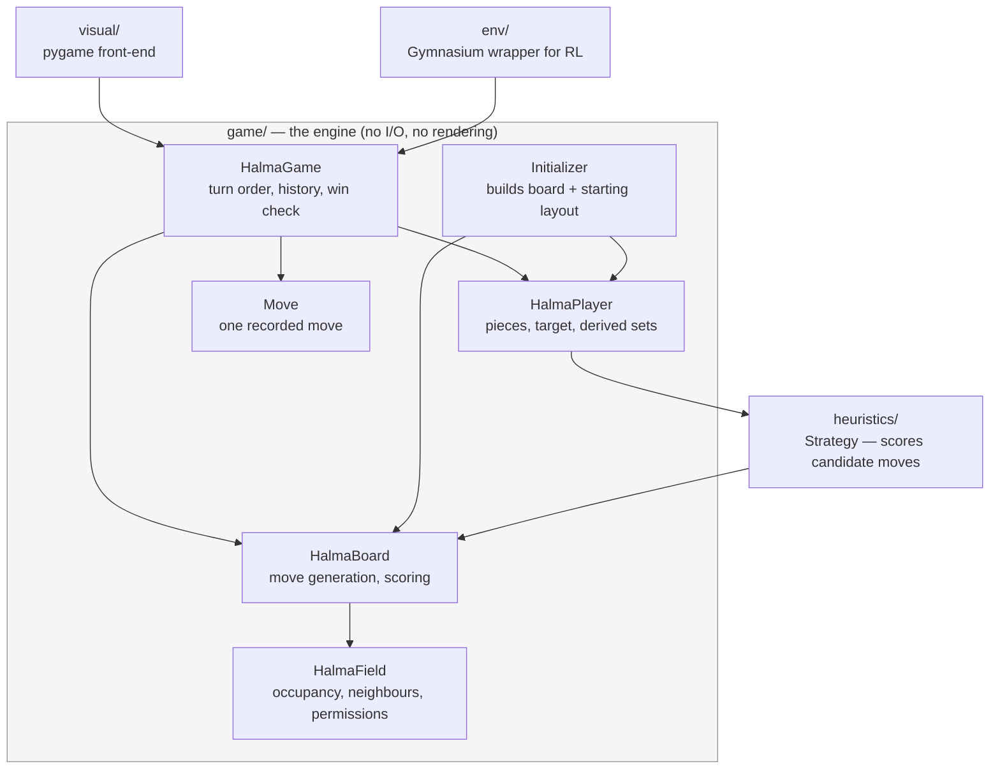

# Architecture

How this codebase is put together and why. `README.md` covers what the project
is and how to run it; this file explains the internals. `CLAUDE.md` holds the
day-to-day conventions for working in the repo and points here for structure.

---

## The shape of the system

The game engine is pure Python and knows nothing about pygame, numpy-heavy
tensors or reinforcement learning. Everything else is a consumer of it.



The single most important consequence: **changing engine behaviour affects three
consumers**, and only one of them (`visual/`) is something you can see. Check
`heuristics/`, `visual/` and `env/` when you touch `game/`.

---

## The board

121 fields forming a six-pointed star (Chinese-Checkers style). Each field has
up to six neighbours — two at the star's tips.

`Initializer.buildFields` builds it as a **9×9 rhombus (81 fields) plus four
ten-field triangles (40)**. Note that this construction does *not* line up with
the six home regions, which is the confusing part:

- Up to three players, **15 pieces each** — a triangle of 1+2+3+4+5.
- For players 1 and 2 that home region **straddles the seam**: 10 fields come
  from an explicitly built triangle, the remaining 5 from the rhombus's edge
  row (`(i, -4)` and `(-4, i)` respectively).
- Player 3's home region lies **entirely inside a corner of the rhombus**
  (`(4-j, i)`), with no explicit triangle at all — which is why its coordinates
  look unlike the other two.

So "the four triangles" are a construction detail of the geometry, not the
players' home bases. A player's target is the star point opposite their start.

### Three ways to address a field

This is the main source of confusion in the codebase. Every field carries all
three; `HalmaBoard` converts between them.

| Name | Form | Used for |
|---|---|---|
| `coord` | axial hex `(x, y)` | geometry: distance, rotation, flipping, drawing |
| `id` | `0`–`120` | **everything else**: `board.fields[id]`, player positions, moves, RL actions |
| `fieldNumber` | `(x+8) + (y+8)*17` | internal only — lets `initEdges` find neighbours by offset arithmetic on a 17×17 grid |

`fieldNumber` is scaffolding. It exists so adjacency can be computed as simple
addition (`directionMapper`) before everything is re-expressed as `id`s. It
never becomes state on any object — `initEdges` builds the index it needs as a
local — and it should not leak into new code.

The three are tied together by one rule worth knowing: **a field's `id` is its
rank in `fieldNumber` order**. `Initializer.buildFields` builds the fields in
that order, so the id is just the index — the "fields must be ordered by id"
contract on `setFields` is satisfied by construction rather than by a later
sort. That in turn makes `board.coordFromId(id)` a plain `fields[id].coord`
with no lookup, and only the reverse direction needs an index
(`board.idFromCoord`, built once in `setFields`).

The board owns that index because it is board data. `Initializer` keeps no
state at all: it builds fields and hands them over, and when it later needs a
coordinate translated — placing the players' starting layout — it asks the
board, the same way `initEdges` and `initPermissions` already take the board as
a parameter. The dependency only ever points from initializer to board.

### Field permissions

`Initializer.initPermissions` marks a field as exclusive to one player when
*every* neighbour of that field is also in that player's own start/end set —
i.e. the interior of their home triangles. All other fields are open to
everyone. This is what stops a player from parking a piece in someone else's
target and blocking them out forever.

---

## Moves: two representations

A move is a sequence of field `id`s, but it exists in **two forms**, and picking
the wrong one is an easy mistake:

- **Endpoints only** — `(start, end)`. Produced by `board.allValidMoves`. This
  is what the RL env and the scoring heuristics use.
- **Full path** — `[start, land, land, ..., end]`. Produced by
  `board.allValidMovesWithWay`. The visualization needs it to draw a multi-hop
  jump, and `Move` needs it to know the intermediate landings.

There is **one** generator, not two: `allValidMovesWithWay` runs the BFS over
chained jumps, and `allValidMoves` is its endpoints view. A single step goes to
an empty neighbour; a jump hops over an occupied field onto the empty one
directly beyond, and jumps chain. Only the piece's own field is queued, so a
step is never chained into a jump.

`Move` stores whatever it was given. If it only got endpoints,
`reconstructFullMove` recovers the path by BFS and records the jumped-over
fields — see the invariant on `jumpedOvers` below.

---

## Layer by layer

### `game/` — the engine

`HalmaGame` owns the board, the players, the turn order and the move history,
and decides who has won. `ComputedGame` (all bots) and `InteractiveGame` (one
human) differ *only* in which players they seat; all behaviour lives in the base
class.

Turn order is randomised once at setup (`computePlayersOrder`) and then rotates
by move count — `currentPlayer()` is derived from `len(self.moves)`, not stored.
That is what makes stepping backwards through history work without extra
bookkeeping.

A player wins by filling their target base, **or** when their target base is
completely full including opponent pieces (`playerIsWinningByBlockedFields`) —
otherwise a single squatter could deadlock the game forever.

`HalmaBoard` does double duty: move generation *and* the heuristic scoring
functions the bots rank positions with (`simpleDistanceScore`,
`advancedDistanceScore`, `sparsityScore`, `playerSparsityScore`,
`potentialJumpScore`, `homeBonusScore`). For all of them **lower is better**.

### `heuristics/` — the bots

`Strategy` maps a name (`"advancedDistScore"`, `"sparsityScore"`,
`"simpleDistScore"`, `"random"`) to a combination of the board's scoring
functions. `bestMove` evaluates every candidate by **applying it to the real
board, scoring, then reversing it**, and picks a minimum at random among ties.

The mutation is scoped by `board.moveApplied(move, player)`, a context manager
that undoes the move in a `finally`. Copying the board per candidate would be
far more expensive, and the undo is exact — see the invariants. The consequence
to keep in mind is that scoring is *not* read-only: a board can only be scored
by one caller at a time, so candidate moves for a single position cannot be
evaluated in parallel. Running several independent games at once is unaffected,
since each has its own board.

### `visual/` — the pygame front-end

`GameVisualization` is the orchestrator and owns the main loop. It holds no
drawing logic itself; it wires up four single-purpose collaborators:

- **`BoardProjector`** — the only thing that knows about screen geometry and
  the current rotation. Both drawing and click hit-testing go through its
  `coordToPos`/`posToCoord` tables, so a rotated board projects and un-projects
  consistently.
- **`BoardRenderer`** — draws; holds no state of its own.
- **`GamePlaybackController`** — owns the history cursor `moveTraveler` and
  steps the board forwards/backwards by applying and un-applying recorded moves.
- **`HumanInputHandler`** — turns a pair of clicks into a validated move.

The bot only auto-plays when the cursor is at the live front of the game
(`moveTraveler == len(game.moves)`), so reviewing history does not trigger new
moves.

### `env/` — the RL wrapper

`HalmaEnv` wraps a `ComputedGame` as a Gymnasium environment. Actions are
encoded as `start * fieldCount + end`.

The interesting part is `boardNormalizer.Normalizer`. The board is symmetric, so
it precomputes field-id permutations for each player's viewpoint
(`player1WithFlip`, `player2WithoutFlip`, … plus inverses) that map any
player/orientation into one canonical frame. The intent is that a single policy
can learn from a symmetry-reduced state space instead of learning each
orientation separately.

> **Status:** this layer is scaffolding, not working code. See *Current state*.

---

## Invariants you must not break

These are load-bearing and mostly non-obvious. Each is pinned by a test.

**1. `player.distanceScore` is maintained incrementally.**
`board.updatePlayerDistanceScore` adjusts only the terms that changed rather
than recomputing over all pieces. Two properties depend on it and are verified
in `tests/test_scores.py`: applying a move and then its reverse restores the
score exactly, and the incremental value matches a full recomputation. Both
`Strategy.bestMove` and `GamePlaybackController.backwardGame` rely on this.

**2. Reversing a move is a true undo.**
`applyMoveForPlayer((end, start), player)` must restore the board *and* the
player's derived sets (`positions`, `nonArrived`, `openEndPositions`). Playback
and bot search both depend on it.

**3. `Move.jumpedOvers is None` means "not reconstructed yet".**
It must **not** be initialised to `[]` — `needsReconstruction()` reports on
exactly that `None`, so an empty list would make every move look already
reconstructed. `fullStepsList()` raises a `RuntimeError` if called first.

**4. Derived player sets are updated on every move.**
`nonArrived` and `openEndPositions` are kept in sync by
`updatePositionWithMove` so the heuristics never have to recompute them. Code
that moves pieces by writing `field.playerID` directly (as some tests do
deliberately) bypasses this and leaves the player object stale.

---

## How a move actually happens

**A bot move**

```
HalmaGame.playNextMove(player)
  └─ getNextMove          → board.allValidMovesWithWay(player)   (full paths)
       └─ player.chooseMove → Strategy.bestMove
            └─ for each candidate: apply → score → reverse
  └─ playMove             → board.applyMoveForPlayer  (moves piece, updates
                             player sets + distanceScore)
                          → append Move to history
```

**A human move**

Click a piece, then a destination. `HumanInputHandler` collects the two clicks,
validates the pair against `allValidMovesWithWay`, plays it through the same
`playMove`, and advances the playback cursor so rendering stays in sync.

**Stepping through history**

`GamePlaybackController` replays or un-applies recorded moves on the *live*
board — there are no board snapshots. `gameStateAt(n)` rewinds to the start and
replays `n` moves.

---

## Design decisions worth knowing

**camelCase throughout.** Un-pythonic but consistent. Ruff's `N` rules are
deliberately disabled (`ruff.toml`) because enabling them reports ~300
violations and would invite a rename touching every file for no functional gain.
Match the surrounding style in new code.

**The engine never prints.** `HalmaGame.play()` returns the winner's identifier
(or `None` on a draw by exhaustion) instead of writing to stdout, because
self-play training runs it thousands of times. `printBoard()` is the one
deliberate exception — printing is its purpose.

**Distances are precomputed.** `calculateDistanceMatrix` fills a 121×121 table
once at setup so the heuristics can look up any pair in O(1).

**Board dimensions are derived, never hardcoded.** The field count comes from
`len(board.fields)` and the piece count from `len(player.positions)` /
`len(player.endPositions)`, including in the RL action encoding
(`HalmaEnv.fieldCount`). The numbers 121 and 15 should not appear as literals.

---

## Current state

| Area | State |
|---|---|
| `game/` | Refactored, documented, characterization-tested |
| `heuristics/` | Working; the only functioning bots today |
| `visual/` | Working; refactored into focused modules. No tests |
| `env/` | **Scaffolding — does not satisfy the Gymnasium API.** No tests |

`env/` is the next thing to be built, and it is genuinely broken rather than
merely incomplete: `action_space` is missing entirely (there is a `reward_space`
that is not a Gymnasium concept), `reset()` returns a 4-tuple instead of
`(obs, info)`, `step()` takes `(player, permutationKey, action)` instead of
`step(action)` and returns 4 values instead of 5, and move selection is a random
choice (`dummyNN`). `models/` is empty. `gymnasium.utils.env_checker.check_env`
rejects the environment on the first check.

The planned direction is: fix the env to the Gymnasium 1.x API, train a
self-play PPO agent against the existing heuristic bots as a baseline, then
replace the pygame front-end with a browser-based one (backend around the
unchanged engine + a canvas front-end).
