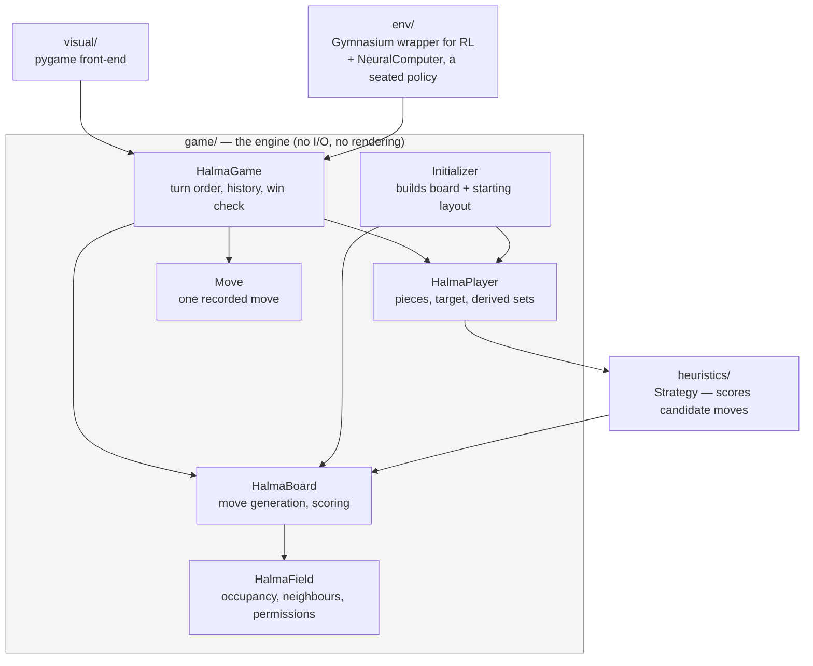

# Architecture

How this codebase is put together and why. `README.md` covers what the project
is and how to run it; this file explains the internals. `CLAUDE.md` holds the
day-to-day conventions for working in the repo and points here for structure.

---

## The shape of the system

The game engine is pure Python and knows nothing about pygame, numpy-heavy
tensors or reinforcement learning. Everything else is a consumer of it.



The single most important consequence: **changing engine behaviour affects three
consumers**, and only one of them (`visual/`) is something you can see. Check
`heuristics/`, `visual/` and `env/` when you touch `game/`.

The consumers stay unaware of each other; `visual/` does not import `env/`. Where
the two meet — a human playing a trained policy — it is a script that wires them
together (`scripts/playAgainstAgent.py`), because `env.NeuralComputer` is just a
`HalmaPlayer` and the front-end cannot tell it from a heuristic bot.

---

## The board

121 fields forming a six-pointed star (Chinese-Checkers style). Each field has
up to six neighbours — two at the star's tips.

`Initializer.buildFields` builds it as a **9×9 rhombus (81 fields) plus four
ten-field triangles (40)**. Note that this construction does *not* line up with
the six home regions, which is the confusing part:

- Up to three players, **15 pieces each** — a triangle of 1+2+3+4+5.
- For players 1 and 2 that home region **straddles the seam**: 10 fields come
  from an explicitly built triangle, the remaining 5 from the rhombus's edge
  row (`(i, -4)` and `(-4, i)` respectively).
- Player 3's home region lies **entirely inside a corner of the rhombus**
  (`(4-j, i)`), with no explicit triangle at all — which is why its coordinates
  look unlike the other two.

So "the four triangles" are a construction detail of the geometry, not the
players' home bases. A player's target is the star point opposite their start.

### Three ways to address a field

This is the main source of confusion in the codebase. A field carries the first
two; `HalmaBoard` converts between them.

| Name | Form | Used for |
|---|---|---|
| `coord` | axial hex `(x, y)` | geometry: distance, rotation, flipping, drawing, and finding the field a jump passed over |
| `id` | `0`–`120` | **everything else**: `board.fields[id]`, player positions, moves, RL actions |
| `fieldNumber` | `(x+8) + (y+8)*17` | build-time only — lets `initEdges` find neighbours by offset arithmetic on a 17×17 grid |

`fieldNumber` is pure scaffolding and does not exist outside `Initializer`: it
is derived from `coord` where adjacency is being wired and is deliberately not
stored on the field, because nothing after construction has a use for it. New
code should not reintroduce it.

`coord`, by contrast, is *not* build-time only — a common assumption worth
correcting. Rendering, click hit-testing, the distance matrix, the RL symmetry
permutations and `Move`'s jumped-over calculation all need it while the game is
being played.

The three are tied together by one rule worth knowing: **a field's `id` is its
rank in `fieldNumber` order**. `Initializer.buildFields` builds the fields in
that order, so the id is just the index — the "fields must be ordered by id"
contract on `setFields` is satisfied by construction rather than by a later
sort. That in turn makes `board.coordFromId(id)` a plain `fields[id].coord`
with no lookup, and only the reverse direction needs an index
(`board.idFromCoord`, built once in `setFields`).

The board owns that index because it is board data. `Initializer` keeps no
state at all: it builds fields and hands them over, and when it later needs a
coordinate translated — placing the players' starting layout — it asks the
board, the same way `initEdges` and `initPermissions` already take the board as
a parameter. The dependency only ever points from initializer to board.

### Field permissions

`Initializer.initPermissions` marks a field as exclusive to one player when
*every* neighbour of that field is also in that player's own start/end set —
i.e. the interior of their home triangles. All other fields are open to
everyone. This is what stops a player from parking a piece in someone else's
target and blocking them out forever.

---

## Moves: two representations

A move is a sequence of field `id`s, but it exists in **two forms**, and picking
the wrong one is an easy mistake:

- **Endpoints only** — `(start, end)`. Produced by `board.allValidMoves`. This
  is what the RL env and the scoring heuristics use.
- **Full path** — `[start, land, land, ..., end]`. Produced by
  `board.allValidMovesWithWay`. The visualization needs it to draw a multi-hop
  jump, and `Move` needs it to know the intermediate landings.

`game/boardTypes.py` names both (`MoveEndpoints` = `tuple`, `MovePath` =
`list`), so the distinction is checkable by the editor and not just described
here. The same file names `FieldId`, `Coord` and `PlayerId`.

`PlayerId` is an `int` — a seat number, 1 to 3. Never a name, and never 0,
because 0 is what an empty `HalmaField` holds. `board.boardState()` collects
those ids into a numpy array that the RL layer does arithmetic on, so a string
identifier would turn it into a string array in which every empty field
compares unequal to 0 and reads as an opponent's piece. Whether a player is
human is answered by `isHuman()`, not by their identifier.

There is **one** generator, not two: `allValidMovesWithWay` runs the BFS over
chained jumps, and `allValidMoves` is its endpoints view. A single step goes to
an empty neighbour; a jump hops over an occupied field onto the empty one
directly beyond, and jumps chain. Only the piece's own field is queued, so a
step is never chained into a jump.

`Move` stores whatever it was given. If it only got endpoints,
`reconstructFullMove` recovers the path by BFS and records the jumped-over
fields — see the invariant on `jumpedOvers` below.

---

## Layer by layer

### `game/` — the engine

`HalmaGame` owns the board, the players, the turn order and the move history,
and decides who has won. `ComputedGame` (all bots) and `InteractiveGame` (one
human) differ *only* in which players they seat; all behaviour lives in the base
class.

Turn order is randomised once at setup (`computePlayersOrder`) and then rotates
by move count — `currentPlayer()` is derived from `len(self.moves)`, not stored.
That is what makes stepping backwards through history work without extra
bookkeeping.

A player wins by filling their target base, **or** when their target base is
completely full including opponent pieces (`playerIsWinningByBlockedFields`) —
otherwise a single squatter could deadlock the game forever.

`HalmaBoard` does double duty: move generation *and* the heuristic scoring
functions the bots rank positions with. For all of them **lower is better**:

| primitive | what it measures | cost |
|---|---|---|
| `openTargetDistanceScore` | mean remaining travel of the pieces still out, to the targets still free | 0.085 µs |
| `unfilledTargetScore` | fraction of target fields still empty | 0.136 µs |
| `tipDistanceScore` | distance of every piece to the far *tip* of the target triangle | 0.311 µs |
| `stragglerLagScore` | how far the most backward piece has fallen behind the pack's mean | 3.34 µs |
| `jumpPotentialScore` | jumps currently available | 5.16 µs |
| `clusteringScore` | deviation of each piece's neighbour occupancy from an ideal 0.75 | 5.63 µs |
| `stragglerTravelScore` | remaining travel of the most backward piece, outright | 1.30 µs |

The first two are what a bot needs at minimum; the rest are shape advice. Note
the two-decade cost gap between them, which is why the cheap bots are cheap.

`openTargetDistanceScore` is O(1) because it only normalises the incrementally
maintained `player.distanceScore` (invariant 1). `player.targetDistance` is a
constant per-field vector built at setup — distance to the nearest target field
free or not — and it is **not** a scoring function: it exists as a lower bound
inside `stragglerTravelScore`, having been measured and rejected as a ranking
measure.

### `heuristics/` — the bots

The five bots, and what each adds to the one above it:

| bot | formula | per candidate |
|---|---|---|
| `random` | constant | 0.09 µs |
| `distance` | `(openTargetDistance + unfilledTarget) / 2` | 0.33 µs |
| `tipDistance` | the same with the tip measure instead | 0.57 µs |
| `straggler` | `distance + 0.05 · stragglerTravel` | 1.7 µs |
| `shaped` | `openTargetDistance + unfilled + 0.13 · unfilled · (clustering + stragglerLag + jumpPotential)` | 14.7 µs |

**These names changed on 2026-08-14** — `advancedDistScore`, `simpleDistScore`,
`sparsityScore` and `bottleneck` respectively — because the old ones had stopped
describing the code. `advancedDistScore` was no longer the advanced one, and
`sparsityScore` the bot and `sparsityScore` the primitive were different things,
which is a trap when editing an opponent pool. `Strategy.ALIASES` still accepts
the old spellings so recipes written before then keep running; they are meant to
be removed once those recipes have moved over.

`Strategy.SCORERS` maps a strategy name to the method implementing it and is
the single source of truth for which strategies exist — construction validates
against it and `scripts/baseline.py` enumerates `STRATEGY_NAMES`, so no second
list can drift. `bestMove` evaluates every candidate by **applying it to the
real board, scoring, then reversing it**, and picks a minimum at random among
ties.

Two findings are worth recording, because both cost real time to establish and
would otherwise be rediscovered the expensive way:

- **Opponent-awareness cannot help at one ply.** An opponent's distance and
  home-bonus terms are *identical* across all of the mover's candidates — the
  opposition does not move while you evaluate your own options — so subtracting
  them shifts every candidate equally and cannot change which move wins.
  Measured: one distinct value across 72 candidates. It only pays inside a
  search, where the replies differ, which is what `LookaheadStrategy` is for.
- **Rewarding long available jump chains makes the bot worse**, badly: 8.8% and
  0.0% win rates against `distance` at two weights. Preferring
  positions that *have* long chains keeps pieces hoarding jump potential
  instead of advancing.
- **Aiming `tipDistanceScore` at the target *zone* instead of at one field
  makes the bot worse**, and this is the opposite of what the same measure does
  as a shaping potential (see the reward section below), so it is worth being
  precise about why. Ranking wants a *fine-grained* gradient: every field has
  its own distance to the tip, so candidates are ordered everywhere on the
  board, whereas distance to the nearest target field is full of plateaus that
  leave candidates tied — and `bestMove` breaks ties at random, so the bot
  dithers rather than finishing. Measured over 150 games with seats swapped,
  against the tip version: zone distance 31.3% (±7.4) with 29 draws, restricted
  to the pieces still out 22.0% with 70 draws, and aiming at the nearest *free*
  target 22.0% with 79 draws. As `straggler` rather than `plainDistance` the
  zone version scores 22.7%. The draw counts are the tell — the tie-breaking,
  not the direction, is what is lost.

  The same run answers a second question: `player.distanceScore` is not
  redundant with it. Dropping the distance-to-open-targets term and ranking on
  the zone distance alone scores 5.3% against the blend and 2.0% against the
  tip version. The two terms measure different things — one is static and
  fine-grained, the other tracks which targets are still free.

What does work is `stragglerTravelScore`: the distance still facing the piece left
furthest behind. The game ends only when every piece is home, so the sum of
distances is the wrong late objective — it collapses while one straggler
decides the length of the game. Adding it to `plainDistance` wins 84% (±5.9 over
150 games) against plain `plainDistance`, robust across weights from 0.02 to 1.0.

What also works is **taking the static term out of `plainDistance` altogether**,
which is where the two findings above meet: its distance half used to be a
blend, half tip distance and half the incremental
distance-to-open-targets score, and it is stronger with the tip half simply
gone. Over 400 games with seats swapped it wins 60.5% (±4.8) head to head
against the blend, and improves against every third party as well — 20.2%
against `straggler` where the blend managed 18.5%, 21.8% against
`shaped` against 19.2%, 92.0% against `tipDistance` against 88.8%.
As `straggler`, and so as `lookahead2`'s leaf, it is level: 53.2% (±3.5) over
800 games.

What it buys is not a better distance measure but a larger share for
`unfilledTargetScore`; keeping the distance term's old weight and changing only the
measure scores 34.0%. It is also **2.6x cheaper** — `openTargetDistanceScore` reads
the incrementally maintained `player.distanceScore` in O(1) where the static
term sums over 15 pieces, 0.081 µs against 0.422 µs, taking the scorer from
0.583 µs to 0.224 µs. That is the number that matters for
`scripts/pretrain.py`, which generates its samples with this bot. It does *not*
speed `straggler` up meaningfully: `stragglerTravelScore` alone is 7.2 µs, so it
swamps everything the distance terms do.

`shaped` held the blend for a while longer, because it adds its shape terms to
the distance term directly instead of averaging, so those terms were weighted
against the blend's magnitude implicitly: shrink the distance term by 7.5 and
they take the vote back, which is the endgame failure its own docstring records.
The leaner version lost **0.0%** of 800 games that way, and scaling the survivor
back onto the old magnitude only reached 19.8%.

**Making that weight explicit is what removed the blend, and it bought a much
stronger bot.** `shaped` is now `openTargetDistanceScore + home +
SHAPE_WEIGHT · home · shape`, weight 0.13, and over 400 games with
seats swapped it wins 81.3% (±4.4) against the version it replaced, 58.2%
against `straggler` where that version managed 38.0%, 92.0% against
`distance` against 74.5%, and 99.8% against `tipDistance` against
96.8%. Two warnings for anyone touching the weight: the response is **not
smooth** — 0.08 → 72.0%, 0.10 → 62.0%, 0.13 → 81.3%, 0.16 → 79.3% — and above
0.16 it falls off a cliff to 23.7% at 0.20 and 4.5% at 0.30, which is the
endgame failure returning. Measure it, do not reason about it.

**`stragglerTravelScore` is a pruned search, not the literal max-over-mins.** The
literal form is 15×15 lookups and was 55% of `lookahead2`'s time per move. It
now seeds the running maximum with `player.targetDistance` — the distance to the
nearest target field free or not, hence a lower bound — and stops each inner
scan at the first free target within that bound. Both shortcuts are exact;
`tests/test_scores.py` compares it against the literal formula for every
position of a full game. Measured: 5.9× faster early, 2.7× at ply 80, taking a
`lookahead2` move from 75.4 ms to 35.3 ms and a full `straggler` game 1.6×
faster.

Strength order, all measured: `lookahead2` > `shaped` > `straggler` >
`distance` > `tipDistance` >> `random`. `InteractiveGame` seats the
strongest; `ComputedGame` keeps the cheap one-ply bots because it feeds the RL
environment, where a two-ply search at ~130ms a move is out of the question.

`shaped` sits at the top of the one-ply bots, not the bottom — this line
said the opposite until 2026-08-13, from before the endgame fix in its docstring
took it from 22.5% to 78.3%, and it moved again when the shape weight was
measured. Two of the four beat the one `scripts/pretrain.py` clones from, which
is worth weighing before the next clone.

Seats confer no advantage, which is what makes `scripts/baseline.py` readable:
in 400 mirror games seat 1 won 47.8% (±4.9) and the player on move 53.5%
(±4.9) — both consistent with an even game.

The mutation is scoped by `board.moveApplied(move, player)`, a context manager
that undoes the move in a `finally`. Copying the board per candidate would be
far more expensive, and the undo is exact — see the invariants. The consequence
to keep in mind is that scoring is *not* read-only: a board can only be scored
by one caller at a time, so candidate moves for a single position cannot be
evaluated in parallel. Running several independent games at once is unaffected,
since each has its own board.

#### No term is redundant, and the expensive one is the least useful

Two questions that look like one: do two primitives *measure* the same thing,
and does the bot *need* both. `scripts/scoreCorrelation.py` answers the first,
`scripts/ablateTerms.py` the second, and they disagree in a useful way.

**Correlate primitives within a position, not over a game.** Over the course of
a game every primitive drifts with the game's progress, so the correlations are
high across the board and mean almost nothing — `tipDistanceScore` and
`unfilledTargetScore` reach 0.98. But that shared drift is common to every
candidate move in a position and cancels out of the ranking entirely. Ranking
candidates is the only thing a scorer does, so the correlation that matters is
Spearman across the candidate set of one position, averaged over positions.
Measured over 17,848 positions and 3,627 candidate sets, the two views differ
sharply: 0.98 → 0.53 for that pair, 0.93 → 0.55 for `tipDistanceScore` against
`openTargetDistanceScore`.

The open question about the two straggler terms is answered by this:
`stragglerTravelScore` and `stragglerLagScore` correlate at **0.39** within a
position (0.29 over the game). They are not two spellings of one measurement,
and neither subsumes the other.

**How much of a vote a term has is not its scale.** On the calibrated scale, the
spread of each primitive across the candidates of a position:

| primitive | spread across candidates | flat |
|---|---|---|
| `jumpPotentialScore` | 0.128 | 0.0% |
| `clusteringScore` | 0.064 | 0.0% |
| `stragglerLagScore` | 0.032 | 0.0% |
| `openTargetDistanceScore` | 0.028 | 0.0% |
| `stragglerTravelScore` | 0.027 | 4.1% |
| `unfilledTargetScore` | 0.020 | 6.3% |
| `tipDistanceScore` | 0.012 | 0.0% |

`jumpPotentialScore` varies 4× as much across candidates as the other two shape
terms it is weighted equally with, so it decides `shaped`'s shape vote almost by
itself. The "flat" column is how often a primitive takes one value across every
candidate and cannot influence the choice at all, which is the mechanism behind
`STRAGGLER_WEIGHT` being recorded as barely mattering.

**And it earns the least.** Dropping each shape term from `shaped` and playing
the result against `shaped`, 200 games each (`scripts/ablateTerms.py`):

| dropped | as is | magnitude restored |
|---|---|---|
| `clustering` | 22.5% (±5.8) | 41.5% (±6.8) |
| `stragglerLag` | 24.5% (±6.0) | 3.0% (±2.4) |
| `jumpPotential` | 47.0% (±6.9) | 23.0% (±5.8) |

Every term is load-bearing, so none can simply go — but `jumpPotential` is
nearly free to remove: 45.5% (±4.9) over a further 400 games, so it is worth
some 4 points. It is also **6.00 µs of `shaped`'s 16.01 µs**, more than a third
of the cost of the panel's strongest one-ply bot and the reason it cannot be
searched on. Largest vote, largest cost, smallest contribution: that is a
misweighting, not a bad term, and it is the clearest evidence that the weights
are worth fitting rather than sweeping once the scales are comparable.

The rescaled column is a warning of its own. Restoring the lost magnitude helps
in one case and is catastrophic in another (`stragglerLag`, 24.5% → 3.0%), so
the total magnitude of the shape sum is not a dial that can be reasoned about
separately from which terms are in it. Same lesson as `SHAPE_WEIGHT`'s
non-smooth response, from a different direction.

#### The scale of a primitive is a hidden weight, and it was never chosen

`heuristics/calibration.py` maps a raw primitive onto [0, 1] through its own
measured distribution, which is uniform by construction. It exists because the
primitives are measurements on unrelated scales and `shaped` adds five of them
together: whatever divisor each one happens to carry *is* its weight in that
sum. Measured over 57,110 positions from 40 games of every pairing of the four
scoring bots:

| primitive | min | max | mean | std | distinct |
|---|---|---|---|---|---|
| `tipDistanceScore` | 2.56 | 12.50 | 6.98 | 2.95 | 156 |
| `openTargetDistanceScore` | 0.08 | 0.94 | 0.58 | 0.18 | 3780 |
| `clusteringScore` | 0.13 | 0.87 | 0.46 | 0.14 | 1517 |
| `stragglerLagScore` | 0.09 | 1.04 | 0.47 | 0.20 | 233 |
| `stragglerTravelScore` | 1.00 | 13.00 | 9.14 | 2.98 | 13 |
| `jumpPotentialScore` | 0.53 | 0.97 | 0.78 | 0.06 | 1136 |
| `unfilledTargetScore` | 0.07 | 1.00 | 0.62 | 0.29 | 15 |

The `/12` and `/16` divisors are simply wrong — `tipDistanceScore` reaches 12.5
and `stragglerTravelScore` is not divided at all — and the spreads differ by 5×
across the three terms `shaped` weights equally, so `jumpPotentialScore` has a
third of `openTargetDistanceScore`'s vote purely by accident.

**The obvious fix, a calibrated sigmoid, does not fit these distributions.** The
logistic CDF is exactly the right transformation for a logistic variable, so it
was the first thing tried; its worst-case deviation from uniform ran 0.044 to
0.194 across the seven, against 0.015 to 0.021 for a 33-knot quantile table.
`jumpPotentialScore` is sharply peaked and `tipDistanceScore` nearly flat —
neither is bell-shaped. The sigmoid path is kept in the module because it is
half the cost and the obvious thing to reach for again; nothing currently
selects it. The two coarse primitives hit a floor no map can beat: 13 and 15
distinct values cannot spread evenly over an interval, so their best possible
deviation is 0.169 and 0.107, and the table reaches exactly that.

`scripts/calibrateScores.py` does the measuring and writes
`heuristics/calibrationData.py`, which is checked in so runtime never depends on
having run it. Regenerate it when a primitive's definition changes.

A quantile map's slope is 1/density, so it spreads differences where positions
are dense and compresses the tails — and ranking candidates depends on precisely
those differences. A calibrated primitive is therefore a *different* bot, not a
rescaled one, which is why `shaped` was not converted in place: `calibrated`
below is the converted version and both exist. Cost per calibrated term is
0.13 µs, which is +5% on `shaped` and +23% on `straggler`. Only the `shaped`
lineage is converted so far; `straggler` is `lookahead2`'s leaf and the search
pays that surcharge b² times a move, so it wants its own measurement.

#### `calibrated`: one scoring function, a family of bots, fitted weights

Calibration is what makes a weight mean something, and the payoff is that the
weights can then be *fitted* rather than guessed. `Strategy.calibrated` is
`shaped`'s terms on the common scale with one weight each — `SHAPE_WEIGHT`, a
single number that covered three terms of very different spreads, splits into
five — and `CALIBRATED_VARIANTS` makes a bot out of nothing but a weight vector,
where a switched-off term is a weight of 0.

Two properties of that formulation carry the whole approach. The score is
**linear in the weights**, so a position's candidates reduce to one small matrix
and evaluating a weight vector is a multiply. And the weights are **scale-free**
— multiplying all of them by a positive constant reorders nothing — so
`distance` is pinned at 1.0 and the search is four-dimensional, not five.

`unfilledTargetScore` appears twice with two different meanings, and only one of
them is calibrated. As a summand it is a score like any other. As the factor
that fades the shape terms out it is not a score at all but the fraction of the
target still empty, and the endgame depends on it reaching exactly 0 — which a
calibrated version never does, its lowest knot maps to 0.0065. Calibrating it
would quietly undo the fade that took `shaped` from 37 stuck games in 40 to
none. The rule that falls out: **calibrate summands, never factors.**

`scripts/fitWeights.py` fits a variant by successive halving on win rate — 192
vectors at 24 games, the survivors at 48, 120, 300 — with every candidate in a
round playing the same seeds against the same opponents, so the comparisons are
paired. Two approaches were tried and both failed in ways worth recording:

- **Fitting on agreement with `lookahead2`** is the tempting cheap fitness:
  deterministic, thousands of vectors a second, no game noise. It is useless
  here, and the reason is a fact about the panel worth knowing on its own —
  measured over 200 sampled positions, **`straggler` already picks `lookahead2`'s
  move 99.5% of the time**. The search almost never departs from its own leaf.
  So "agree with the search" means "be `straggler`", and the vectors that
  maximised it lost every game they played (`shaped` scores 45.0% on the same
  measure, `distance` 39.5%).
- **Fitting against one opponent** produced a counter, not a better bot: against
  `shaped` alone it found a vector that beat `shaped` 62.7% over fresh seeds
  while being *weaker than `shaped`* against everyone else — 53.0% against
  `straggler` where `shaped` scores 58.2%, 82.3% against `distance` where it
  scores 92.0%. These bots are not transitive enough for that. The fitness is a
  pool, cycled by seed.

The fitted weights, against a pool of `shaped` and `straggler`:

| bot | distance | home | clustering | stragglerLag | jumpPotential |
|---|---|---|---|---|---|
| `calibrated` | 1.0 | 3.885 | 0.052 | 0.166 | 0.040 |
| `calibratedCluster` | 1.0 | 1.000 | 0.130 | 0 | 0 |
| `calibratedJump` | 1.0 | 2.803 | 0 | 0 | 0.316 |
| `calibratedClusterJump` | 1.0 | 3.886 | 0.316 | 0 | 0.040 |

Two more were fitted at the same time and **removed on 2026-08-21**, both for
duplicating `distance` rather than for being weak: `calibratedPlain` (`home`
8.760, no shape terms) and `calibratedLag` (`home` 2.753, `stragglerLag` 0.125).
See below.

**The headline is `home`.** `shaped` weights it 1.0 against the distance term;
the fit wants 3.885, and wanted 8.760 for the variant with no shape terms at
all. That is the same finding as the 2026-08-14 rebuild — dropping the static
distance half helped because it gave `unfilledTargetScore` a larger share —
except that this says the share was still far too small. The three shape terms
shrink correspondingly, `jumpPotential` most of all, to 0.040.

Confirmed on fresh seeds, 300 games per pairing, none of them seen by the fit:

| | vs `shaped` | vs `straggler` | vs `distance` |
|---|---|---|---|
| `calibrated` | **73.7% (±5.0)** | 60.7% (±5.5) | 88.7% (±3.6) |
| `shaped` | — | 60.0% (±5.5) | 89.3% (±3.5) |

That is the bar the first fit failed: decisively ahead head to head *and* level
against third parties, rather than a specialist. `calibrated` is now the
strongest one-ply bot. Zero draws in all 1,800 games, so the fade held.

The partial variants are **not** meant to be strong. They exist because `env/`
trains against an opponent pool, and a pool of near-identical bots teaches an
agent to beat one opponent. So the two questions that decide membership are
whether they are *sound* and whether they are *different*, not how they rank.

#### The family is sound, and half of it is redundant

**Sound**, measured 2026-08-21 at 200 games per pairing on unseen seeds: **zero
draws in all 2,000 games**, average length 115–126 moves. Nothing in the family
stalls, so nothing in it poisons a training pool. Against `distance`:

| `calibratedJump` | `calibratedCluster` | `calibratedLag` | `calibratedPlain` (since removed) |
|---|---|---|---|
| 83.0% (±5.2) | 80.0% (±5.5) | 74.0% (±6.1) | 48.0% (±6.9) |

**Different is where it falls down.** `scripts/variantAgreement.py` measures
pairwise move agreement over a shared position set — 1,500 positions sampled
from the family's own games, each reduced to the feature matrix that makes
scoring a weight vector one multiply. Agreement counts a shared *best set*
rather than an identical move, because `bestMove` breaks ties at random.

Two results, both about the middle of the game (see below for why that bucket):

- **`calibratedPlain` is `distance` wearing a different hat.** They agree on
  **91.4%** of midgame positions and 97.5% early, and the win rate said the same
  thing from the other side — 48.0% is a coin flip. With no shape terms it is
  `distance` plus a fitted `home` weight, and 8.760 is a big enough weight to
  reorder some moves but not to make a different bot. It adds nothing to a pool
  that could hold `distance` itself.
- **`calibratedJump` is the genuine outlier**, and the strongest partial besides.
  It agrees with nothing: 32.4% with `distance`, 18.0% with `calibratedCluster`,
  45.6% with `calibrated`. `calibratedCluster` is the second most distinct
  (34.5–47.1%). Those two are the pool's real content.

`calibratedLag` sits with `calibratedPlain` and `distance` in one cluster (90.4%
and 87.5%) and **was removed for it on 2026-08-21**, one step milder than
`calibratedPlain` but for the same reason — it added no coverage the pool did
not already have. That is a verdict on the weight vector and not on
`stragglerLagScore`, which stays in `calibrated` and is worth 24.5% to `shaped`
when ablated. `calibrated` agrees with `shaped` 80.3% — expected, since it is
`shaped`'s weights transplanted, but it means a pool should hold one of them and
not both. Read against the tie sizes the script prints: `calibratedPlain` and
`distance` leave 2.65 and 2.66 candidates of 69 tied for best, the highest in
the panel, which puts chance agreement near 10% rather than anywhere near 90%.

**The midgame is the discriminating bucket**, which the fade argument alone
would not predict — the family agrees *more* early than in the middle
(`calibratedCluster` against `calibrated`: 65.1% early, 37.0% middle, 58.9%
late). Early, every candidate is some way of advancing a packed home triangle
and the shape terms have little to disagree about; late, `unfilledTargetScore`
has faded them out by construction. Only in between are the pieces spread out
enough for clustering, lag and jump potential to point different ways.

There is also a tension worth naming: the fit weighted `jumpPotential` down to
0.040, near off, yet the variant built on it is both the strongest partial and
the most distinctive player. Strength and distinctiveness are being bought by the
same term the full bot nearly discards, which bears on the open question of what
`jumpPotentialScore` is for.

#### It is the shape terms that separate them, not the `home` spread

Every member carries a large `home` weight — 1.0 to 3.886, the biggest term in
each vector — which invites the worry that the family is one slider rather than a
space, and that the low agreement numbers come from that spread rather than from
the shape terms. Measured 2026-08-21 by pairing each bot with a **twin** that
keeps its distance and `home` weights and zeroes every shape term. Midgame:

| | real bots | their twins |
|---|---|---|
| `calibrated` vs `calibratedClusterJump` | 53.6% | **100.0%** |
| `calibratedJump` vs `calibratedClusterJump` | 53.0% | **96.0%** |
| `calibratedCluster` vs `calibratedJump` | 16.8% | 54.2% |

The first row is the cleanest case and doubles as the control: those two weight
`home` at 3.885 and 3.886, so their twins *are* the same bot and duly agree
100%. The real bots disagree on 46% of midgame moves, and every point of that is
the shape terms. Against its own twin each bot scores 78.1% (`calibrated`),
65.4% (`calibratedCluster`), 48.8% (`calibratedJump`) and 48.0%
(`calibratedClusterJump`) — so for the last two the shape term decides the move
about half the time. They are not decoration on a shared distance bot.

The twins carry a design fact of their own: at `home` 2.803, 3.885 and 3.886
they agree 96–100%, and only `calibratedCluster`'s 1.0 sits anywhere else (52.4%
against the rest). **The upper `home` band is a flat region** — moving the weight
around inside it buys no distinctiveness at all, which is worth knowing before
fitting another variant that lands there. Diversity through `home` means going
low, not varying between 2.8 and 3.9.

#### Fitting for strength does not fit for a pool

`calibratedPlain` was dropped and its slot fitted afresh over `clustering` +
`jumpPotential`, the two axes furthest apart in the panel. The run is the reason
this section exists as its own heading, because **the fit's own criterion picked
the wrong bot** and the failure mode generalises to every pool member fitted
from here on.

Three finalists came out of the search statistically level over 300 games each —
60.3% (±5.5), 56.3% (±5.6), 56.3% (±5.6) against the `shaped`/`straggler` pool.
Win rate could not separate them. Move agreement separated them cleanly, and in
the **opposite order**:

| finalist | win rate | highest midgame agreement with any bot |
|---|---|---|
| `home` 9.655, `clu` 0.059 | 60.3% | **83.0%** (`calibrated`) |
| `home` 5.986, `clu` 0.227 | 56.3% | 68.0% (`calibrated`) |
| `home` 3.886, `clu` 0.316 | 56.3% | **63.2%** (`shaped`) |

The nominal winner is a `home`-heavy, shape-terms-off vector — which is to say
the search, left to maximise win rate, walked straight back to `calibratedPlain`
and would have rebuilt the duplicate the slot was opened to remove. **In this
panel win rate pulls towards `home`-heavy distance-like play**, so any fit whose
fitness is win rate pulls pool members together rather than apart. The adopted
vector is the third one, and adopting the least strong of a statistically tied
set is not a concession here: the pool wants coverage, and the strength floor is
soundness, not rank.

It cost nothing anyway. Confirmed at 200 games per pairing on seeds the fit never
saw, **zero draws in 2,000 games**:

| `calibratedClusterJump` vs | `distance` | `calibratedCluster` | `calibratedJump` | `calibrated` |
|---|---|---|---|---|
| | 81.0% (±5.4) | 70.5% (±6.3) | 51.5% (±6.9) | 48.0% (±6.9) |

Level with `calibrated`, the strongest one-ply bot in the panel, while agreeing
with nothing above 63.2%. Note also that it is a *second* cluster bot — the fit
drove `jumpPotential` to 0.040 again, so the name records the term set searched
rather than two live terms — and yet it agrees with `calibratedCluster` on only
29.9% of midgame positions. Two bots built on the same single term play almost
entirely differently at 2.4x the clustering weight and 3.9x the home pull, which
is worth remembering before assuming the term set is what makes a variant
distinct. It is the weights.

What that leaves spanning the space: `calibratedJump`, `calibratedCluster`,
`calibratedClusterJump`, one of `calibrated`/`shaped`, and `straggler` (which
agrees with the family only 28.5–59.2%).

#### Diversity is bounded by playability, and the bound is tight

The obvious way to widen a pool is a bot per primitive — one that scores only
`clustering`, one only `jumpPotential`. Measured on 2026-08-21, that does not
work, and the boundary it runs into is worth knowing before anyone designs
another variant.

| against `distance`, 40 games | win% | draws | avg moves |
|---|---|---|---|
| `clustering` only | 0.0% | 0 | 141 |
| `jumpPotential` only | 0.0% | 0 | 135 |
| `stragglerLag` only | 0.0% | 0 | 142 |
| `home` only | 0.0% | 0 | 128 |
| `distance` 1.0, `home` 0.1, `clustering` 3.0 | 0.0% | 1 | 145 |
| `calibratedCluster` (control) | 95.0% | 0 | 121 |

**The zero draws are not a clean bill of health** — the opponent is ending those
games. Played against each other, where nobody drives towards the target, the
same bots stall completely: `clustering`-only against `jumpPotential`-only draws
**12 of 12 at the 250-move ceiling**, and so does either against itself.

The third-from-last row is the one that generalises. That bot *has* a distance
term, weighted 1.0, and it still stalls 12 of 12 against itself — a shape weight
of 3.0 simply outvotes it. So the constraint is not "keep some distance term"
but a ratio, and the sound region is narrow: `calibratedCluster` carries 0.13
against `home` 1.0 and wins 95%. This is the same cliff `SHAPE_WEIGHT` records
from the other side (0.16 → 79.3%, 0.20 → 23.7%, 0.30 → 4.5%) and the same
failure the fade was introduced to fix, when `shaped` hung in 37 games of 40.

The consequence for pool design is a real limit rather than a caution. **Every
sound weight vector has to be distance-dominated, so every sound bot in this
family is somewhat distance-like**, and that — not just the win-rate fitness
above — is why fitted variants keep collapsing towards `distance`. There is
still room inside the bound, as the 29.9% between the two cluster bots shows,
but it is room and not open space. Widening the pool further wants one of:
a genuinely new primitive rather than a reweighting of these five; or diversity
bought at the episode level instead of the bot level, where `--opponentSampling`
and varied openings already offer more spread than any reweighting can.

### `visual/` — the pygame front-end

`GameVisualization` is the orchestrator and owns the main loop. It holds no
drawing logic itself; it wires up four single-purpose collaborators:

- **`BoardProjector`** — the only thing that knows about screen geometry and
  the current rotation. Both drawing and click hit-testing go through its
  `coordToPos`/`posToCoord` tables, so a rotated board projects and un-projects
  consistently.
- **`BoardRenderer`** — draws; holds no state of its own.
- **`GamePlaybackController`** — owns the history cursor `moveTraveler` and
  steps the board forwards/backwards by applying and un-applying recorded moves.
- **`HumanInputHandler`** — turns a pair of clicks into a validated move.

The bot only auto-plays when the cursor is at the live front of the game
(`moveTraveler == len(game.moves)`), so reviewing history does not trigger new
moves.

### `env/` — the RL wrapper

`HalmaEnv` wraps a `ComputedGame` as a Gymnasium environment. Actions are
encoded as `start * fieldCount + end`.

`env/neuralPlayer.py`'s `NeuralComputer` is the other consumer of that
encoding: a `HalmaPlayer` backed by a `MaskablePPO` checkpoint, so a trained
policy can be seated like any bot (`scripts/playAgainstAgent.py` does this
against `visual/`). It keeps a `HalmaEnv` purely as an encoder and repoints it
at whatever game is actually being played (`attachTo`) rather than
reconstructing the observation by hand — one implementation of the encoding,
used both to train and to play. That is also why `HalmaEnv.game` is typed as
the `HalmaGame` base class rather than `ComputedGame`: only the base API is
used, which is what lets the same encoder sit on an `InteractiveGame` too.

`env/searchPlayer.py`'s `SearchingComputer` is a `NeuralComputer` that expands
the policy's best moves one ply before committing: the policy orders the moves,
the top `candidates` are played out, each answered by the top `replies` moves of
the same network seated on the other side, and the critic evaluates the leaf. It
is the only thing here that uses the value head at all — training fits it, and
`NeuralComputer` never asks for it. Two details it depends on, both recorded in
the module docstring: the critic's number is the *shaped* value, so `V' + w*phi`
is what compares across positions, and `_legalCache` is keyed on the game's move
count, which `moveApplied` does not bump, so it is cleared rather than trusted at
every searched node. It also declines to re-enter a board state it has already
been on turn in, which is a rule rather than something learned. Measured below:
the search as built plays *worse* than the policy it wraps, and the repetition
rule works.

`HalmaEnv` takes a `selfSeat` (default `AGENT_SEAT`), and a `NeuralComputer`
passes its own identifier through, so its encoder builds the observation from
whichever seat it actually occupies. Training only ever uses seat 1, but this
is what lets two checkpoints play each other (`scripts/compareCheckpoints.py`)
instead of each only being measurable against a common panel of bots. The
constructor still refuses any seat but `AGENT_SEAT`/`OPPONENT_SEAT` — the
normalizer has no permutation for a third.

Gymnasium models one agent against a world; Halma has two players. So the agent
owns one seat and the heuristic opponent moves *inside* `step` — one env step is
a full round. Only ~65 of 14641 encoded actions are legal at a time, so
`action_masks()` is not optional: without it the policy would spend itself
learning which actions are illegal rather than which are good.

#### What the network is shown

The observation is a `Dict` of a `(14, 17, 17)` board and five scalars. The
board is the 17×17 raster `fieldNumber` already embeds the hex star in, which
is what lets a convolution see that neighbouring fields are neighbours at all —
a flat 121-vector hides that completely.

| # | plane | changes during a game |
|---|---|---|
| 0 | own pieces | yes |
| 1 | opponent pieces | yes |
| 2 | field mask — which of the 289 cells are real fields | no |
| 3 | own target zone | no |
| 4 | own start zone | no |
| 5 | opponent target zone | no |
| 6 | opponent start zone | no |
| 7 | closeness to own target, `1 - d/max(d)` | no |
| 8 | closeness to the opponent's target | no |
| 9–12 | jump class, one-hot over the 4 classes | no |
| 13 | closeness to a *same-class* own target | no |

Scalars: move-budget progress, own pieces home, opponent pieces home, own
mobility, parity mismatch.

Planes 3–13 are **constant**, and were left out for exactly that reason until
2026-08-07 — after normalisation the zones never move, so they carry no
information about the position. That argument is right about information and
wrong about what a convolution can use: conv weights are shared across the
board, so the stack is translation invariant and literally cannot tell which
end of the star a pattern it has found is sitting at. Planes 3–13 are the
positional encoding that breaks that invariance. The gain is confined to the
conv stack — the flatten hands the head every cell separately, so the head
always had position.

One thing the constant planes do **not** need is disambiguation. A `0` on the
distance maps means either "outside the star" or "as far as it gets" — exactly
one real field is at the latter — and a `0` on a class plane means "not this
class". Plane 2 sits at the same cell in the same tensor, so the first
convolution separates the cases in one linear combination. It costs nothing and
is worth stating only because the encoding looks lossy written down.

#### Jumps cannot change parity, and that is a whole feature

The six jump deltas on this board are `(±2, 0)`, `(0, ±2)` and `(±2, ∓2)` —
every one of them even in both coordinates. So **a jump, and therefore a jump
chain of any length, can never leave the class `(x mod 2, y mod 2)` it started
in.** Only a single step changes class, and a single step covers one field
where a jump covers two. The 121 fields split into four such classes, of sizes
37/28/28/28. Enumerated over `jumpNeighbours` for all 121 fields, not assumed.

This is the sharper invariant than the parity of the *distance*: a delta of
`(1, 1)` has hex distance 2, which an even-distance argument would call
jump-reachable, and it is not.

What follows from it is a quantity nothing else in the system expresses. The
pieces not yet home have to fill the target fields not yet occupied; within a
class that is free, but a class holding more stragglers than it has open target
fields must send the surplus across a boundary, at a minimum of one single step
each. Summed over the four classes, that surplus — `_parityMismatch` — is a
**lower bound on the single steps still owed**, and remaining *distance* is
completely blind to it: two positions with identical travel left can differ by
several forced steps.

It is zero at the opening, and that is not luck — the start and target zones
have the same class distribution (6/3/3/3), so the opening is already perfectly
matched and a jump-only solution is not ruled out. It is zero again once every
piece is home. So it measures a detour the middle game can wander into and back
out of, which is exactly the shape a shaping term should have. Measured over
six random games it runs 0–4 with a mean of 2.2.

Three things carry it into the network and the reward:

- **Planes 9–12**, the class one-hot, so a convolution can read it off per
  cell. One-hot rather than a compact code for a measured reason: all three
  step deltas are odd in at least one coordinate, so **from any class a single
  step reaches all three others** — the four classes form a complete graph,
  every pair one step apart. There are no near and far classes, so any
  encoding carrying a metric misstates the board. A plane holding 1..4 would
  imply class 1 and 4 are far apart; a two-bit `(x mod 2, y mod 2)` code (what
  this replaced) makes a weaker version of the same mistake, putting `(0,0)`
  two bits from `(1,1)` and one from `(1,0)` where the board puts both at one
  step. Four mutually equidistant indicators state what is true and nothing
  else, for 1,152 parameters in the first convolution.

  Painted over **all 289 cells**, not the 121 real fields: parity belongs to
  the raster, `row % 2` is defined everywhere, and stopping at the star's edge
  would break the checkerboard exactly where a 3×3 kernel straddles the
  boundary. This is the one plane group where filling the void reads the
  raster rather than inventing data — a distance map has nothing to say about
  a cell no piece can occupy, which is why those stay 0 and lean on the mask.
- **Plane 13**, the distance map restricted to targets of the field's own
  class: "how far can this piece get without ever taking a single step". It
  differs from plane 7 on 56 of the 121 fields — by one step on 50 of them and
  by two on 6 — so it is a second map, not a rescaling of the first. This, not
  the class planes, is what carries the *long-range* comparison: two 3×3
  convolutions see 5×5, and a piece is usually nowhere near the target zone.
- **The potential**, via `parityWeight` (`--parity`, default 0.25, 0 is the
  control). See below — the form it takes is the part that needed care.

The class *labels* differ between the raw frame (`parityClass`, which
`_parityMismatch` and plane 13 use) and the canonical one (the planes). That is
fine and is pinned by a test: a rotation permutes the labels **bijectively**, so
the partition of the board into classes is identical either way, and nothing
cross-references a label across the two. `_parityMismatch` sums over all four
classes, which makes it invariant under the relabelling outright.

**Four distinct zones, not two.** `Initializer` puts seat 1 on the bottom
corner travelling to the top and seat 2 on the *left* corner travelling to the
right, so the two seats do not face each other across the star: own start, own
target, opponent start and opponent target are four different corners of the
six, sharing only the single field where two of them touch.

**The distance maps are not binary, deliberately.** A zone plane says where the
goal is; `1 - d/max(d)` says which way is forwards from anywhere on the board,
which is the same quantity `_progress` shapes the reward with. Cells outside
the star stay 0, which the mask plane already distinguishes from a genuinely
distant field.

All eleven are painted once in `__init__` and copied into every observation. They
go through the *same* `normalizer.permute` call the board state does, so they
are indexed by canonical field id by construction rather than by an argument
about which direction the permutation runs — and a test pins that the geometry
comes out identical whichever seat builds it, which is the canonical frame's
whole promise stated on the one part of the observation that could silently
contradict the pieces.

#### The trunk is shared, the branches are not

`env/features.py` runs the convolutions once and gives the policy and the value
their own path out of them, because the two want different things from the same
board — "which piece, where" against "is this structure won":

| | policy branch | value branch |
|---|---|---|
| out of the trunk | 1×1 squeeze to 8 channels | one more 3×3, then 1×1 to 16 |
| spatial | full 17×17, flattened | full 17×17 flattened **plus** a global average over the trunk's 64 channels |
| MLP behind it | `pi=[64, 64]` | `vf=[256, 256]` |

`HalmaFeatures` returns the two branches concatenated and
`env/policy.SplitMlpExtractor` cuts them apart again, because Stable-Baselines
runs one extractor and hands its whole output to both networks. The alternative
sb3 offers, `share_features_extractor=False`, builds two complete extractors and
so pays for the convolutions twice; here the trunk runs once.

What this changes, in parameters: the critic-only path went from **20,673 to
1,371,217**, and the whole policy from 689,403 to 2,043,403. It is the direct
answer to the capacity candidate raised under "Search on top of the critic
makes the policy weaker" below — and only to that candidate. The other one, that
PPO never asks the critic to rank siblings at all, is untouched by any amount of
capacity, and the probe recorded there is still the measurement that says which
was binding.

Measured cost, `train.py`'s defaults over 6,000 steps on one machine: **245 →
175 steps/s**, so a step buys about 71% of what it used to. `valueChannels` is
the knob if that turns out not to pay for itself — the 16-channel squeeze is
1.2M of the 1.37M.

**This breaks every existing checkpoint.** `Talos1.0`, `Talos1.1` and
`Talos1.2` carry a `(3, 17, 17)` observation space and the old undivided
extractor, so they cannot be loaded, seated, or fine-tuned from by any current
script — the same fate as `maskedPPO_300k`'s `Box(246,)` below. The next
generation starts from a fresh `scripts/pretrain.py` clone. This was the
deliberate deferral recorded under the deadlock discussion: the observation
space was going to have to change eventually, and changing it once is cheaper
than twice.

`opponentStrategy` takes either one bot name or a sequence of them. A sequence
is a pool: `reset()` draws one at random (from the seeded `np_random`, so the
draw is reproducible) and that is who the agent faces for the whole episode.
This exists because PPO fine-tuning against a single fixed bot sharpens
against *that* bot specifically: the agent fine-tuned to 99% against
`distance` falls to 90–92% against random, weaker than the clone it
started from (96%), which never trained against a fixed opponent at all —
`scripts/pretrain.py` fits it to a bot's move choices by cross-entropy rather
than playing against it. Training against a pool is the fix under test:
`scripts/train.py --opponentPool` accepts several names, while `--opponent`
still names the one bot progress reports and final results are measured
against, whether or not it is in the pool.

`opponentModel` seats a frozen checkpoint as the opponent instead of a
heuristic — a `NeuralComputer` built once in `__init__` and reused every
episode via `attachTo`, the same reuse `scripts/compareCheckpoints.py` relies
on, rather than reloaded from disk each reset. It takes priority over
`opponentStrategy`/`opponentPool` when given. `env/neuralPlayer.py` imports
`HalmaEnv` itself, so `HalmaEnv` cannot import `NeuralComputer` at module
level without a cycle; the import is deferred to inside `__init__`, the usual
fix for a two-module cycle like this one. This is a fixed sparring partner,
not self-play — the opponent's weights never move, only the trained side's
do. `scripts/train.py --opponentModel PATH` wires it up, threading through
progress reports and the before/after evaluation the same way a heuristic
opponent would. True self-play — the opponent kept in step with training
rather than frozen — is still unbuilt.

`opponentModelPool` extends `opponentPool`'s per-episode draw to frozen
checkpoints as well as heuristics: `reset()` draws from the combined pool
(skipped, like `opponentPool`'s own draw, whenever `opponentModel` has pinned
a single fixed opponent), so one run can mix heuristic and tuned-model
opponents rather than being limited to one or the other. Every checkpoint in
the pool is loaded once in `__init__`, same reasoning as `opponentModel`.
`scripts/train.py --opponentModelPool PATH [PATH ...]` wires it up; the
periodic progress-report callback prints one win-rate column per candidate in
that case — `--opponent` plus one column per tuned checkpoint — rather than
just the single number a fixed-opponent run tracks.

`opponentStrategy` may also be **empty**, which is the one case where no
heuristic is ever drawn: the combined pool is then the checkpoints alone. It
needs `opponentModel` or a non-empty `opponentModelPool` to supply an opponent
at all, and `__init__` raises if neither is there, because `_seatPlayers()`
runs before the first `reset()` and would otherwise have nothing to seat. This
exists because the heuristic pool could not previously be emptied from the
command line — `--opponent` always seeded it, so a nominally checkpoint-only
run still faced a bot on roughly one episode in *n+1*.
`scripts/train.py --noHeuristicOpponents` is the flag.

Note what this is and is not: a pool of frozen past checkpoints is league play,
not true self-play, and the distinction is the same one drawn for
`opponentModel` above — every checkpoint's weights stay fixed for the whole
run. Emptying the heuristic pool changes *who* is in the league, not whether
the opponent tracks the learner.

`opponentSampling` is the fraction of episodes in which a checkpoint opponent
plays its own distribution rather than its argmax move. It addresses the
*opponent* where `randomOpeningPlies` below addresses the *position*, and the
distinction is what the failed random-opening run turned on: varying the
starting position did not stop the learner specialising against one frozen
sparring partner, because that partner still answered every position it was
handed identically. Sampling widens the tree with moves the opponent itself
considers plausible, which is the difference from a uniformly random ply —
those go anywhere, including places no game reaches. The draw is per episode,
not per move, so a game is played against one coherent opponent, and the argmax
opponent still supplies `1 - opponentSampling` of the episodes: a mixture on
purpose, since the run that replaced the standard case outright rather than
mixing it lost measurably on the distribution it stopped seeing (below). Only
neural opponents have a distribution to sample, so `opponentSampling > 0` with
no checkpoint anywhere in the draw is refused rather than silently ignored, and
the draw itself is skipped entirely at 0 — which keeps the random stream of
every earlier run byte-identical, so their seeds still reproduce.
`scripts/train.py --opponentSampling F` wires it up, for training only: the
evaluations keep the argmax opponent every recorded number was measured
against.

`randomOpeningPlies` plays that many uniformly random legal moves before the
agent is asked for anything, so an episode starts from a varied position
instead of the single opening the game otherwise always has. It addresses the
*positions*, not the opponent: a frozen checkpoint answers a given position the
same way every time, so training against one from a fixed opening revisits a
narrow band of the game tree — the same argument `scripts/compareCheckpoints.py`
makes about argmax play having only two possible games per pairing, and the
same one `scripts/openingSweep.py` answers by enumerating openings for
measurement rather than training. Both sides play their share of the random
plies, because randomising only the agent's would leave the opponent replying
out of its usual book. They are counted in total rather than per side and fall
to whoever is on turn, so an even count splits them evenly and an odd one hands
the extra ply to whoever the play order put first — `--randomOpening 6` is
three random moves each, which is what the run below used. The plies belong to `reset()`, not to the episode: the
agent is never asked for them and never trained on them, and `previousPotential`
is taken afterwards so the shaping still telescopes from wherever the opening
left the board — pinned by a test, since a varied start is exactly the sort of
change that could quietly reintroduce the bias potential-based shaping exists to
avoid. `scripts/train.py --randomOpening N` wires it up, and deliberately only
for training: the before/after evaluations keep the standard opening so their
numbers stay comparable with every result already recorded here.

`boardNormalizer.Normalizer` precomputes field-id permutations for each player's
viewpoint (`player1WithFlip`, `player2WithoutFlip`, … plus inverses) that map
any player/orientation into one canonical frame, so a single policy learns one
orientation rather than several.

The `player2...` permutations sat unused until `selfSeat` gave them a caller —
nothing had ever built an observation from seat 2 before — and unused turned
out to mean wrong. The three home corners sit 120 degrees apart in the order
player1 → player3 → player2, not player1 → player2 → player3, so
`player2WithoutFlip` was rotating the board onto **player 3's** corner. Fixed
by rotating 240 degrees instead, and `player2WithFlip` re-derived the same way
rather than patched: `rot300` composed with the Y-axis flip, verified against
an independently-derived coordinate transform on all 121 fields, not just the
subset that happened to look self-consistent. See invariant 7 below for the
second bug this same work found, which is the one that actually cost games.

**The reward is shaped, and it has to be.** Winning is the only true reward and
it arrives once per ~69 decisions — and a random agent, measured over 700 games,
never wins at all. A constant signal teaches nothing, so `_shaping` adds
`weight * (gamma * phi(s') - phi(s))` on every step. This is the potential-based
form (Ng, Harada & Russell 1999) whose terms telescope, so it changes no policy's
ranking — the agent is hurried, not redirected. Verified over 32 completed games:
the discounted return shifts by exactly `-phi(s0)`, to machine precision. Two
conditions: `gamma` must match the training discount, and the potential is zeroed
on termination but deliberately *not* on time-limit truncation, where the agent
should still bootstrap. Set `shapingWeight=0` to turn it off and measure whether
it earns its place. `info["outcome"]` carries the unshaped ±1 so evaluation
scores wins rather than shaping.

The potential is **the agent's own remaining travel**, normalised: the sum, over
its pieces, of the distance from each to the nearest field of its target zone,
divided by the 140 steps facing it at the opening and subtracted from 1. So it
runs 0 at the opening to exactly 1 once every piece is home — and, with 15 pieces
and 15 target fields, a remaining travel of zero *is* the win condition, so the
top of the scale coincides with winning rather than approximating it.

**The parity penalty rides on top of it, multiplicatively.** Travel is not the
whole story — the forced single steps of `_parityMismatch` above are real and
distance cannot see them — so the potential is
`covered * (1 - parityWeight * mismatch / 15)`. The mismatch is 0 at both ends
of the game, so the scale still runs exactly 0 to 1 and the penalty only bites
in between.

Multiplicative after the subtractive form failed twice, which is worth
recording because both failures are the sort that would survive review:

1. `covered - w*mismatch/15` goes **negative** early, when travel is still near
   0 — measured, 5.7% of plies down to -0.024 at weight 0.25. A negative
   potential is exactly the sign bug that taught three runs to stall.
2. Clamping that at zero fixes the sign and breaks the *other* documented
   property: two consecutive clamped plies both have `phi = 0`, so the shaping
   between them is exactly 0 and the signal-on-every-step guarantee is gone.
   The test suite caught this one; nothing about the position looks wrong.

Multiplying has neither failure — both factors are in [0, 1] and both terms
stay monotone, so advancing always helps, clearing parity debt always helps,
and the potential can neither leave [0, 1] nor go flat while the agent is
moving. What it means is that parity debt costs a *fraction of the ground
already covered*: cheap while there is little to lose, expensive near the end,
which is also when it is genuinely harder to fix.

Two things it is deliberately not:

- **Not the lead over the opponent.** A lead can be held by obstructing as
  easily as by advancing, and an agent trained on the difference took exactly
  that route — it finished with none of its 15 pieces home while holding the
  opponent from 14 down to 12.
- **Not the bots' distance blend plus `unfilledTargetScore`.** That is what
  `heuristics/` ranked moves by when this was decided — no bot does any more —
  and it is a poor thing to shape with. Two thirds
  of it is `tipDistanceScore`, the distance to the single *tip* field of the
  target triangle rather than to the triangle: measured over 235 moves it moved
  ten times further per move than the zone-distance term, so it was effectively
  the whole signal, and it aimed at one corner. It also never bottoms out — a won
  position still scored 1.25 against the opening's 7.69, leaving 16% of the
  shaping budget unreachable and paying pieces already home to shuffle towards
  the tip. Its distance term is averaged over the pieces still out, too, so a
  piece arriving shrank the numerator and the divisor together.

  None of that was an argument for putting the zone distance in the bots
  either: substituting it into `tipDistanceScore` was measured and costs
  them roughly two thirds of their games — see the `heuristics/` section.
  Shaping needs a potential that bottoms out; ranking needs a gradient without
  plateaus, and the tip distance is the one that has no plateaus. Two roles,
  two measures, and `player.targetTip` exists for the second one only.

  What *did* follow, on 2026-08-13, is that `plainDistance` dropped the static
  half of its distance term rather than replacing it — it is the same
  observation as the first sentence above, that the term is coarse and dominant,
  read from the ranking side. `shaped` kept it, because it is the one bot that
  weights its other terms against that magnitude.

Nearest target field per piece, rather than a min-cost assignment of pieces to
target fields. The assignment is the exact remaining travel, but the two
correlate at 0.996 over real games and agree on which moves help, so it is not
worth an O(n³) matching — or a scipy dependency — on every step.

---

## Invariants you must not break

These are load-bearing and mostly non-obvious. Each is pinned by a test.

**1. `player.distanceScore` is maintained incrementally.**
`board.updateOpenTargetDistance` adjusts only the terms that changed rather
than recomputing over all pieces. Two properties depend on it and are verified
in `tests/test_scores.py`: applying a move and then its reverse restores the
score exactly, and the incremental value matches a full recomputation. Both
`Strategy.bestMove` and `GamePlaybackController.backwardGame` rely on this.

**2. Reversing a move is a true undo.**
`applyMoveForPlayer((end, start), player)` must restore the board *and* the
player's derived sets (`positions`, `nonArrived`, `openEndPositions`). Playback
and bot search both depend on it.

**3. `Move.jumpedOvers is None` means "not reconstructed yet".**
It must **not** be initialised to `[]` — `needsReconstruction()` reports on
exactly that `None`, so an empty list would make every move look already
reconstructed. `fullStepsList()` raises a `RuntimeError` if called first.

**4. Reversing nests correctly across players.**
`LookaheadStrategy` applies its own move and then the opponent's reply inside
it. Each `moveApplied` block undoes exactly its own move and they unwind in
order, so both players' `positions`, `nonArrived`, `openEndPositions` and
`distanceScore` come back unchanged. Pinned in `tests/test_strategy.py`.

**5. Derived player sets are updated on every move.**
`nonArrived` and `openEndPositions` are kept in sync by
`updatePositionWithMove` so the heuristics never have to recompute them. Code
that moves pieces by writing `field.playerID` directly (as some tests do
deliberately) bypasses this and leaves the player object stale.

**6. `gameLength()` is the position's version, and `HalmaEnv` caches on it.**
Every real move goes through `playMove`, which appends to the move list, and
`currentPlayer()` is derived from that count — so the move count identifies the
position within an episode. `HalmaEnv._legalActions` memoises on it, because
generating moves is the most expensive thing the environment does and one step
used to ask five times over (the caller's `action_masks()`, `step`'s legality
check, the opponent's search, the mobility scalar, and `action_masks()` again
inside `_info`) for what are only two distinct positions. Scoring a candidate
does *not* bump the count — `moveApplied` goes straight to the board — which is
sound only because scoring never calls `_legalActions`. Hand-placing pieces
does not bump it either, so tests that do that must not then read the mask.
`reset` clears the entry, since a new game restarts the count.

**7. `HalmaEnv._needsFlip` keys on a seat's fixed home corner, not its current
pieces.** It picks between two mirror-symmetric but equally valid canonical
frames, and both are correct in isolation — the mistake this guards against is
subtler than choosing the wrong one. Keying on *current* piece positions makes
the choice a function of where those pieces have wandered to, and a seat whose
pieces cross the sign threshold mid-game (seat 2's do; seat 1's never do in
practice, confirmed over 200 seeds) gets the canonical frame swapped out from
under it almost every ply once its pieces straddle that line — a discontinuity
training never produces, because it only ever trains seat 1, whose frame
never moves. The cost was not cosmetic: a checkpoint at 99% against a heuristic
from seat 1 lost 20/20 from seat 2, and 0/20 in self-play against its own
seat-1 copy, while every other property of the encoding — the permutation math,
byte-identical observations at the opening, move legality, per-move progress —
checked out. Keying on `startPositions` instead (fixed for the whole game)
recovered both: self-play went to a roughly even 17/13, seat 2 against the
heuristic to 29/30. Pinned in `tests/test_env.py` by moving a player's current
pieces to the far side of the board without touching `startPositions` and
asserting the flip choice does not follow them.

**8. A reused player object must not carry positions between games.**
`prepareForGameStart` resets `positions` from `startPositions` rather than
unioning into it, precisely so a player object seated in a second game does
not keep whatever pieces it had not yet gotten home in the first. Every
caller in `game/` and `heuristics/` constructs a fresh player per game and
never needed this; `scripts/compareCheckpoints.py` reuses the same
`NeuralComputer` across many games specifically to avoid reloading a
checkpoint from disk each time, and hit it immediately — `board.py` reads
`player.positions` directly to generate moves, so a stale union proposed
moves from fields the fresh board had never placed a piece on, and applying
one corrupted the board outright. Pinned in `tests/test_game_setup.py` by
reseating the same two player objects across two games and checking
`positions` resets rather than leaks.

---

## How a move actually happens

**A bot move**

```
HalmaGame.playNextMove(player)
  └─ getNextMove          → board.allValidMovesWithWay(player)   (full paths)
       └─ player.chooseMove → Strategy.bestMove
            └─ for each candidate: apply → score → reverse
  └─ playMove             → board.applyMoveForPlayer  (moves piece, updates
                             player sets + distanceScore)
                          → append Move to history
```

**A human move**

Click a piece, then a destination. `HumanInputHandler` collects the two clicks,
validates the pair against `allValidMovesWithWay`, plays it through the same
`playMove`, and advances the playback cursor so rendering stays in sync.

**Stepping through history**

`GamePlaybackController` replays or un-applies recorded moves on the *live*
board — there are no board snapshots. `gameStateAt(n)` rewinds to the start and
replays `n` moves.

---

## Design decisions worth knowing

**camelCase throughout.** Un-pythonic but consistent. Ruff's `N` rules are
deliberately disabled (`ruff.toml`) because enabling them reports ~300
violations and would invite a rename touching every file for no functional gain.
Match the surrounding style in new code.

**The engine never prints.** `HalmaGame.play()` returns the winner's identifier
(or `None` on a draw by exhaustion) instead of writing to stdout, because
self-play training runs it thousands of times. `printBoard()` is the one
deliberate exception — printing is its purpose.

**Distances are precomputed.** `calculateDistanceMatrix` fills a 121×121 table
once at setup so the heuristics can look up any pair in O(1).

**Board dimensions are derived, never hardcoded.** The field count comes from
`len(board.fields)` and the piece count from `len(player.positions)` /
`len(player.endPositions)`, including in the RL action encoding
(`HalmaEnv.fieldCount`). The numbers 121 and 15 should not appear as literals.

---

## Current state

| Area | State |
|---|---|
| `game/` | Refactored, documented, characterization-tested |
| `heuristics/` | Working; five bots, strength measured against each other |
| `visual/` | Working; refactored into focused modules. No tests |
| `env/` | Satisfies the Gymnasium API, masked and shaped; trained policies playable via `NeuralComputer` |
| Agent | Cloned from a bot, then fine-tuned by PPO to 99% against `distance` |

`env/` passes `gymnasium.utils.env_checker.check_env` and has action masking, a
canonical observation and reproducible seeding.

`scripts/baseline.py` plays every pairing of the bots and is the yardstick a
trained agent has to clear. The number that shaped the plan: **a random agent
wins none of 700 games**, so an untrained policy sees the same reward in
essentially every episode. That is why shaping came before training.

`scripts/evaluateAgainstBots.py` is the other half of that yardstick: a
checkpoint against the bots, argmax and sampled, for as many checkpoints as
asked for. `baseline.py` covers bot against bot and `compareCheckpoints.py`
checkpoint against checkpoint; this third side existed only as the tail of a
training run, so re-measuring an existing checkpoint meant training something
to get the report. `lookahead2` is ~20x slower per game than the scoring bots,
which is what `--bots` is for.

`scripts/randomPositionSweep.py` measures the one thing none of those do:
whether a checkpoint plays well from positions it has no reason to be familiar
with. Every other yardstick here starts a game at the opening or two plies into
it — the position a policy has seen most. This one deals each game a start of
4–20 uniformly random legal plies, drawn from its own `--seed`ed generator so
the same deal is handed to any pair of checkpoints. Uniformly random rather
than sampled from either contestant, deliberately: a position distribution one
side generated would favour that side, which is the one thing a benchmark must
not do. The cost is that some deals are positions no sensible game reaches —
that is the breadth being measured, but it does mean the score answers "how
well does it cope off its own track", not "how strong is it", and
`openingSweep.py` stays the answer to the second.

**Each deal is played twice with the checkpoints swapping seats**, because a
random position is not fair — it can hand one seat a won game before either
policy moves — and neither is the side to move. The mirror cancels both
exactly. The control that pins this: the same checkpoint on both sides scores
50.0% ± 0.0 with every pair split, since two identical policies make the two
games of a pair literally the same game. Unlike the opening sweep's census of
all 800 two-ply openings, this is a *sample* of a much larger space, so the
score does carry a confidence interval — and the unit for it is the pair, not
the game, since the two games of a pair share a deal and are not independent.

**Shaping was not enough on its own.** With the reward shaped, the geometry
given to a CNN and the action head factored, PPO from scratch still ended a
quarter hour of training at 0 wins and single-digit percent of pieces home. The
signal is there, but the region of policy space where Halma is played is not
somewhere random exploration arrives.

**What worked was copying a bot first.** `scripts/pretrain.py` plays games with
`straggler` on the agent's seat, records its choice in every position, and fits
the policy to those choices by cross-entropy over the masked distribution. On
150k positions and 12 epochs the policy agrees with the bot on 73% of positions
and goes from 0% wins to 86% against `distance` (argmax, 50 games).
Scored over the same games, the teacher itself takes 68% — but it wins 64% against
`shaped` where the clone takes 54%, so the clone is at roughly teacher
strength and specialised to the opponent its data was collected against, not
generally stronger. `scripts/train.py --init` fine-tunes from that checkpoint.

Mixing the bot into PPO's *own* rollouts — playing the bot's move some fraction
of the time — is the obvious-looking alternative and does not work:
`collect_rollouts` stores the log-probability of the action the policy sampled,
and the update forms `exp(log_prob - old_log_prob)` against it, so a substituted
action leaves the ratio comparing the wrong pair of distributions and nothing
raises. Mixing during *collection* is a real method (DAgger) but its labels come
from the expert and its loss is the supervised one; `pretrain.py --mix --rounds`
implements that form.

**PPO on top of the clone clears its teacher.** 300k steps from `models/cloned`
take it from 82% to **99% against `distance`** (198W 2L of 200 games,
argmax; 97.5% sampled), with the fine-tuned agent also finishing games in 50
steps against the clone's 60. The margins do not overlap, so this is the answer
to the question the shaping and speed work was in service of: reinforcement
learning does add something here, once it starts somewhere it can learn from.

Two things that measurement also settled. The entropy coefficient, set to 0.01
so a from-noise policy would not collapse, turned out not to matter on a cloned
one: 0.001 and 0 land at 99.0% and 99.5%, indistinguishable. What does matter is
step size. At sb3's default learning rate `approx_kl` ran 0.06-0.37 against a
healthy ~0.01 and `clip_fraction` 0.2-0.37, and both runs were thrown back
repeatedly along the way — one from 90% to 40% and back within 50k steps. A
policy that starts sharp needs smaller steps than one that starts diffuse;
`--lr` and `--targetKl` exist for that and the default is still the from-noise
one.

The agent is also **specialised to the opponent it trained against**: 99%
against `distance` but 90-92% against `random`, where the clone was at
96%. Beating one bot decisively is not the same as playing Halma well, so the
measurement worth having was against opponents it never saw.

Measured, 30 games against each of four bots (argmax), mean win rate last:

| checkpoint | plainDistance | straggler | shaped | random | mean |
|---|---|---|---|---|---|
| `cloned` | 80.0 | 46.7 | 60.0 | **96.7** | 70.8 |
| `tunedEnt000` | **100.0** | 90.0 | 76.7 | 86.7 | **88.3** |
| `tunedEnt001` | 96.7 | 90.0 | 76.7 | 90.0 | **88.3** |

At ±11 to ±18 on each cell, only the gaps between the clone and the tuned pair
mean anything. Those say the specialisation is **narrower than it looked**: the
clone is ahead only against `random`, and fine-tuning nearly doubles the score
against `straggler` — the strongest one-ply bot, which neither checkpoint ever
trained on. So PPO on top of the clone did not merely sharpen it against
`distance`; what it lost is ground against the weakest opponent, where
the shortest path to a win is least like anything a bot would play. The two
tuned checkpoints are indistinguishable, which is the entropy finding again.

The comparison goes through a common panel of bots because that is what answers
the question. Each cell is an absolute number against a fixed opponent — and for
three of the four, one no checkpoint ever trained on — so a column is a yardstick
rather than a relative ordering, and all three checkpoints are measurable on it
at once. A head-to-head result says only which of two policies is ahead, and says
it against an opponent that moves as training does.

75k further steps on `straggler` — a heuristic the agent had only ever seen
baked into `cloned`'s imitation data, never as a PPO opponent — pushed
`tunedOnBottleneck` past `tunedEnt000` on every one of those four bots except
`lookahead2` (46% argmax), the one bot none of this lineage has ever trained
against: 100% on `distance` and `shaped`, 96% on `straggler`
itself, 90% on `random`.

Head-to-head is also available now (`scripts/compareCheckpoints.py`, using
`selfSeat`), and building it is what found invariant 7 above: the first
round-robin looked like a bug report rather than a result — seat 1 won every
matchup and seat 2 never won once, regardless of which checkpoint sat where.
The `_needsFlip` fix resolved it; a rerun stopped being seat-biased (draws
went from many, seat 2 repeatedly timing out at the move cap, to zero) and
produced a real ranking. Grown since to eleven checkpoints, every pairing, 30
games at seed 0:

| checkpoint | record |
|---|---|
| `multiVsModel` | 8-2 |
| `tunedEnt000` | 7-3 |
| `pooledFinetuned` | 7-3 |
| `pooledWithLookahead` | 7-3 |
| `tunedEnt001` | 6-4 |
| `multiTeacherTuned` | 5-5 |
| `cloned` | 5-5 |
| `tunedOnBottleneck` | 4-6 |
| `multiTuned` | 4-6 |
| `clone_from_multi` | 2-8 |
| `maskedPPO` | 0-10 |

Single-seed argmax, so treat this as directional rather than a tight
estimate — most matchups were 100/0 or close, a few near-even at 56.7%. Those
near-even numbers have since been explained, and they were not close matches:
under argmax the opening is fixed and both policies are deterministic, so the
seed varies only the play order and a pairing has exactly **two** possible
games, whichever `--games` says. 56.7% is 17/30, the share of those seeds that
let seat 1 start — i.e. the first mover won every game and the two policies
were indistinguishable. The non-transitivity below is the same artefact: about
one bit per matchup, reported with an interval that assumed `--games`
independent samples. `compareCheckpoints.py` now plays every pairing in both
seat directions, and in argmax mode reports the winner per play order instead
of a percentage; `--sampled` is what yields a real win rate (the same 20 seeds
give 17 distinct games). The ranking above predates that and is kept as it was
measured.

The non-transitivity (`pooledWithLookahead` beats `tunedEnt000`, `tunedEnt000`
beats `tunedOnBottleneck`, `tunedOnBottleneck` beats `pooledWithLookahead`) is
therefore mostly measurement noise here, though genuine non-transitivity is
also expected for adversarial policies trained by different processes. `maskedPPO` and `maskedPPO_300k`
predate later architecture changes; the latter now loads but its observation
space no longer matches (`Box(246,)` against the current `Dict`) and is excluded,
the former loads and plays but is the oldest checkpoint here and finished last.
`pooledFinetuned` is simply `pooledWithLookahead` given 100k further PPO steps
against its original pool minus `lookahead2` (dropped for training-loop speed,
~6x slower per step than the other four heuristics) — nothing structurally
new, and it took the top spot outright.

**A multi-teacher clone did not repeat the pooled-opponent generalisation
story.** `scripts/pretrain.py --expert` now takes a list of bots instead of
one; `collect()` draws one teacher per game from a seeded `rng`, so the
recorded moves — and the fitted policy — are a blend rather than one bot's
blind spots. `clone_from_multi` (`distance` + `shaped` +
`straggler` as teachers) reached 68.7% agreement with its blended targets
after 12 epochs, against ~73% for the single-teacher `cloned` — a harder
target, as expected. Fine-tuning it with PPO's default learning rate
reproduced the sharp-policy instability noted above for `cloned`, except this
time it didn't recover: `approx_kl` ran 0.09-0.23 for the full 100k steps and
argmax win rate against bots in the training pool *fell* (`shaped`
54%→22%), with sampled win rates on trained-on bots collapsing to 1%.
Restarting from `clone_from_multi` with `--lr 1e-4 --targetKl 0.03` (200k
steps, four-heuristic pool) fixed it — `approx_kl` held near 0.02-0.03 — and
produced `multiTeacherTuned`, which clears its training panel decisively
(99-100% argmax on three of four bots). But head-to-head against the
existing roster it lands mid-table at 5-4, clearly behind every checkpoint
descended from a single-bot or single-pool clone. The rest of the
multi-teacher lineage does worse still (`clone_from_multi` 1-8, the collapsed
`multiTuned` 4-5). So crushing a fixed heuristic panel and holding up against
other trained policies turned out to be different things here — diversifying
the imitation-learning *teacher* did not buy what diversifying the PPO
*opponent* pool did.

**`HalmaEnv` can now seat a frozen checkpoint as the training opponent**
(`opponentModel`, `scripts/train.py --opponentModel PATH` — see the `env/`
section above), not just a heuristic. That is a fixed sparring partner, not
self-play: the opponent's weights never move during the run. True self-play —
the opponent kept in step with training rather than frozen, the route that
does not inherit a teacher's ceiling — is still unbuilt, and search is a
separate, further-out direction.

**And a fixed model opponent beat both heuristic approaches.** `multiVsModel`
is `clone_from_multi` fine-tuned for 200k steps (`--lr 1e-4 --targetKl 0.03`
from the start this time) against a frozen `pooledFinetuned` -- then the best
checkpoint in the roster -- instead of any heuristic. It went 25%→80% sampled
against that opponent over the run, ended **100-0 argmax against
`pooledFinetuned` itself** in the post-run report, and topped the eleven-way
round robin outright at 8-2, ahead of every heuristic-only lineage including
the one it started from (`clone_from_multi` alone was 2-8). It still
generalises to bots it never trained on -- 91% argmax vs `distance`,
93% vs `random`, though only 25% vs `lookahead2`, which nothing in this
project has ever trained against. Its one clear head-to-head loss is to
`tunedEnt000`. One run is not enough to call this the better method in
general rather than a strong-opponent-plus-lower-lr combination that happened
to work once, but it is the first thing in this whole investigation to beat
`pooledFinetuned` decisively, and the mechanism (fight something that is
already good, rather than a fixed heuristic panel or a blend of teachers) is
the closest analogue to self-play buildable without also updating the
opponent's weights. One thing agreed for later is making
position evaluation parallelisable, which today's `moveApplied` prevents.

**A checkpoint-only league produced `Talos1.1`, and `--targetKl` turned
out to be load-bearing rather than optional.** `scripts/progressivePhase1.py`
runs six rounds of 50k/75k/100k/125k/150k/175k steps, each initialised from the
previous round's checkpoint and trained against the accumulated pool of
`Talos1.0` plus every earlier round — no heuristic anywhere in the draw
(`--noHeuristicOpponents`). The first attempt omitted `--targetKl`, and round 2
collapsed: argmax against `distance` fell 97%→46%, `shaped` to
32%, and it lost 14% of games to `random`, with `approx_kl` running 0.044–0.064
against the ~0.01 that is healthy here. Rerunning that same round with
`--targetKl 0.02` and nothing else changed restored it to 100%. A 2x2 over
{entropy 0.01, 0.03} x {no cap, cap} put the cause beyond doubt: both capped
cells score ~100% across the panel, and entropy 0.03 — the value blamed first —
is fine once updates are capped. The entropy runaway (`entropy_loss` -1.97 to
-2.94) was a symptom of the oversized updates, not the driver. A control that
added a `straggler` anchor to the training pool without the cap recovered only
partially (73%/60%/100%), so pure checkpoint self-play was never the problem
either. `multiVsModel` above had already used `--targetKl 0.03` from the start;
the progressive script simply failed to inherit that.

The heuristic panel cannot measure this lineage any more — every round scores
99–100% argmax on all three bots, as does `Talos1.0` itself, so the numbers say
only that nothing broke. Head-to-head is the only usable yardstick here.
Sampled, both seat directions, 60 games per pairing: `Talos1.1` (round 6,
kept under that name; the intermediate rounds were discarded)
beats `Talos1.0` **65% ± 12.1**, round 1 83%, round 3 95%. But rounds 1 and 3
are statistically level with `Talos1.0` (53.3% and 58.3%, both intervals
spanning 50%), so the first ~225k steps bought nothing measurable and the gain
came from the longer late rounds — worth remembering when picking the next
schedule. Part of round 6's margin is also league specialisation: it beats
round 3 (a pool member) 95% but `Talos1.0` only 65%, while those two are level
with each other, so 65% is the honest figure for general strength.

**Forcing the opening is a better way to compare two checkpoints than either
sampling or plain argmax** (`scripts/openingSweep.py`). Each side has exactly
20 legal opening moves, and
the count does not depend on what the other played, so fixing both gives 400
games per play order and 800 in total — all still played out deterministically,
so the variety costs no sampling noise. Over those 800, `Talos1.1` beats
`Talos1.0` **70.5%** (27.5% lost, 2.0% drawn), which corroborates the 65% above
from a completely different direction. It is a census rather than a sample:
those are *all* the two-ply openings, so no confidence interval applies, and
the open question is whether forced openings represent free play rather than
anything statistical. It also sizes the first-mover advantage properly at about
**5 points** (`Talos1.1` 73.2% when starting against 67.8% when not) — the two
games plain argmax produces make it look decisive, which it is not.

**Random openings did not produce a stronger checkpoint, and the run is kept
only as this paragraph.** 300k steps from `Talos1.1` against a frozen
`Talos1.0`, six random opening plies (three per side), `--lr 1e-4 --targetKl
0.02 --entropy 0.03 --seed 42`. The reasoning was sound and the result was not.
Against the opponent it trained on it improved a lot — 800-opening sweep
**85.1%** against `Talos1.0`, where `Talos1.1` scores 70.5% — but against
`Talos1.1` itself it finished level: 49.9% to 45.8%, 4.4% drawn. So the 300k
steps bought specialisation against one frozen sparring partner rather than
strength, the same trap `--opponentPool` exists for, and randomising the
opening did not prevent it: it varies the *positions*, not the opponent.

The heuristic panel says the same thing from the other side, and adds a cost
the sweep cannot see. Argmax is unchanged and at the ceiling — 98–100% across
the five fast bots, identical to `Talos1.1`. *Sampled* is worse on every
non-trivial bot: `shaped` **42.0% ± 9.7** against `Talos1.1`'s 69.0% ±
9.1, `straggler` 61% against 75%, `distance` 76% against 85%. The
`shaped` gap is far outside both intervals, so the policy's best move is
as good as before while its *distribution* got measurably worse — probability
mass spread onto moves that are poor from the standard opening, which is the
plausible cost of training away from that opening at entropy 0.03.

Two things follow. The checkpoint was discarded rather than versioned, so
`models/` still holds the Talos pair alone. And `randomOpeningPlies` was kept:
the negative result is about this pairing and this budget, not about the
mechanism, and the environment cannot answer the question a second time if the
knob is removed with the checkpoint.

The intermediate stands are worth recording, because they do not move in one
direction: sweeping each against `Talos1.1` gives 53.0% at 100k, 46.9% at 200k,
49.9% at 300k. Three points, no trend, all near level — nothing in the run
suggests a longer budget would have arrived somewhere better. The 20-game
progress column swung 25–55% across the same run while the true strength barely
moved, which is worth remembering before reading anything into that column.

**The baseline off the beaten track, measured 2026-08-05 before any of the
breadth work:** over 200 mirrored deals of 4–20 random plies (400 games,
seed 0), `Talos1.1` scores **60.4% ± 3.5** against `Talos1.0`. The edge is real
and it is roughly ten points smaller than the same pairing's 70.5% on the
opening sweep — so part of what six rounds of league play bought was strength
on the track the league was played on. Depth of the deal does not visibly
change it (`Talos1.0` scores 38.1% ± 5.0 on the shallow half and 41.5% ± 5.0 on
the deep half, intervals overlapping), which says these two are not separated by
how far off-track a position is, only by whether it is off-track at all.

Two things about that measurement cap what it can ever show. **144 of the 200
pairs were split** — each checkpoint won the side the deal put ahead — so most
random positions are decided before either policy moves, and only the remaining
quarter is where a strength difference can register at all. And **51 of the 400
games were drawn, 12.8% against the opening sweep's 2%**: deterministic
deadlock is six times more common from a random position than from the opening,
which is a breadth weakness in its own right rather than a measurement
artefact. Both argue for reading this score as a coarse instrument — a
ten-point move means something, a two-point move does not.

**`opponentSampling` measured neutral over three seeds** (Phase A,
2026-08-05). Two arms of three seeds, 300k each from `Talos1.0` against a
frozen `Talos1.0`, identical but for the knob, every checkpoint scored against
the same reference `Talos1.1`:

| seed | control breadth | sampled breadth | control opening | sampled opening |
|---|---|---|---|---|
| 42 | 40.8% | 51.2% | 33.9% | 48.8% |
| 43 | 48.1% | 48.5% | 43.4% | 39.6% |
| 44 | 51.0% | 47.4% | 41.9% | 40.9% |
| mean | 46.6% | 49.0% | 39.7% | 43.1% |

+2.4 points of breadth, which no rank test can separate — with three seeds a
side, complete separation is the only significant outcome available (p = 1/20)
and seed 43 breaks it. **The finding that outlasts the null result is the
spread**: the control arm alone ranges over ten points on both instruments,
which is as large as the gap seed 42 appeared to show. Single-run conclusions
in this project are not reliable, and the three intermediate stands of the
randomOpening run above said the same thing before anyone was listening.

**`Talos1.2` came out of five progressive rounds of 300k from `Talos1.0`**
(`scripts/progressivePhase2.py`, 2026-08-05), with `--opponentSampling 0.5`
kept in despite the null result — a deliberate bet, recorded as one in that
script's docstring, on the argument that Phase A tested the knob in the setting
where it has least to offer (one sparring partner, one round). Measured against
`Talos1.1` after every round:

| round | steps | breadth | opening |
|---|---|---|---|
| — | 0 (`Talos1.0`) | 39.6% | 29.5% |
| 1 | 300k | 47.1% | 39.5% |
| 2 | 600k | 54.5% | 51.0% |
| 3 | 900k | 63.7% | 68.2% |
| 4 | 1.2M | 63.1% | 70.6% |
| 5 | 1.5M | **64.9%** | **69.4%** |

Final: `Talos1.2` beats `Talos1.1` **69.4%** over the 800-opening census and
**64.9% ± 3.7** on random positions; against the anchor `Talos1.0` it is 82.9%
and 69.2%. The generation step is the same size as `Talos1.1`'s over
`Talos1.0` (70.5%), which is why it is 1.2 and not 2.0.

**The heuristic panel finally says something again, and it is the sampled
column.** Argmax has been at 100% since `Talos1.0`, but sampled play went from
`Talos1.1`'s 85% / 69% / 75% (`distance` / `shaped` /
`straggler`) to **98.3% / 90.0% / 93.3%**. That is the same measurement the
failed randomOpening run drove *down* to 42%, and it is the sharpest evidence
that what improved is the policy's distribution rather than only its best move.

**A fixed reference saturates, and rounds 3-4 show exactly what that looks
like.** Against `Talos1.1` those two rounds scored 63.7% then 63.1% breadth,
68.2% then 70.6% opening — flat, and read on its own it would say the league
had run out. Head to head, `round4` beats `round3` **57.4%**, and `round5`
beats `round4` **72.9%**. So the flatness was the instrument: once a candidate
takes ~70% of a census, the reference has little resolution left to give. From
round 5 the measurement of record became the previous round — a reference that
grows with the run — with `Talos1.1` kept only as the bridge to everything
recorded above it.

The 2% draws are all the same failure and are worth knowing about: two
deterministic policies deadlock. `openingSweep.py` prints which openings drew
and `scripts/replayGame.py --opening` replays one into the pygame window, which
is how this was read off rather than inferred. In the one examined, 248
half-moves visited
only 79 distinct positions, one of them 44 times, entering a **4-half-move
cycle at half-move 75** — one piece per side shuffling between two fields
(17↔29 and 38↔78) while the score stayed frozen at 6-4 for the remaining ~170
moves. Reaching the move cap is already priced as a loss, so the incentive is
right; the cycle survives because a cycle needs *both* sides deterministic, and
that never happens in training — PPO samples the learner's actions while the
frozen opponent is argmax, so the randomness breaks it. Measured: 0 draws in
100 games in the training configuration, average length 113 of a 250 cap. The
agent therefore gets no gradient signal about this at all, and more steps will
not address it; it is an artefact of evaluating a policy in a mode it never
trained in. Fixing it properly means a repetition signal in the observation,
which would change the observation space and invalidate every existing
checkpoint — deliberately deferred to the next generation.

The observation space did change on 2026-08-07 (the geometry planes above), so
that cost has now been paid and the repetition signal is free to follow. It was
**not** included in that change: what belongs in a history encoding — how many
previous plies, whose pieces, or a repetition count rather than raw positions —
is an open question, and bundling an unsettled design into the change that
broke compatibility would have made both harder to read afterwards.

### How the Talos checkpoints were actually built, and what is still on disk

The results above were measured over some sixteen checkpoints, which are named
throughout as if they were still there. They are not: `models/` was pruned to
`Talos1.0` and `Talos1.1` on 2026-08-05 (`Talos1.2` joined them the same day),
because everything else was either
unloadable, superseded, or reachable only through a checkpoint that survives.
The numbers stay valid — they are recorded here and in the commit messages,
which is what `.gitignore` says the history is for — but re-running an old
comparison means retraining its participants.

Two of the discarded ones could not have been re-run in any case:
`shapedByTravel` predates `de6aecd` and fails to load at all (`size mismatch`
in the feature extractor), and `maskedPPO_300k` still carries the pre-geometry
`Box(246,)` observation space, which no current script can feed.

The lineage that produced the surviving pair, reconstructed from the
checkpoints' own metadata and the commands that made them — worth recording
because none of it is derivable from the two files that remain:

| # | checkpoint | how |
|---|---|---|
| 1 | `clone_from_multi` | `pretrain --expert advancedDistScore sparsityScore bottleneck --samples 150000 --epochs 12` (the bot names of the day; `distance shaped straggler` now) |
| 2 | `multiVsModel` | 200k PPO from 1, opponent the frozen `pooledFinetuned`, `--lr 1e-4 --targetKl 0.03` |
| 3 | `multiVsModel2` | 100k from 2, opponent the frozen `tunedEnt000`, same step size |
| 4 | — | 150k from 3, against the five-heuristic pool |
| 5 | — | 100k from 4, against `random` alone |
| 6 | **`Talos1.0`** | 500k from 5, heuristic pool **and** model pool (`multiVsModel`, `multiVsModel2`, `pooledFinetuned`), `--lr 1e-4 --targetKl 0.03` |
| 7 | **`Talos1.1`** | six league rounds from 6, `scripts/progressivePhase1.py` |
| 8 | **`Talos1.2`** | five 300k league rounds from **6**, `scripts/progressivePhase2.py` |

Step 8 branches from step 6, not from step 7: **`Talos1.2` is not a descendant
of `Talos1.1` and never trained against it.** That was deliberate — `Talos1.1`
is the reference every number above is expressed against, and a candidate
trained against its own yardstick scores higher without being stronger, which
is precisely what round 3 of the phase-1 league did (95% against pool members,
65% against `Talos1.0`). It also means the two can be compared without an
asterisk, and that `Talos1.1` can eventually be deleted without orphaning the
lineage — but only once a measurement against `Talos1.0` exists to bridge the
record, which is why the final numbers above report both.

Steps 4-6 all wrote to the same name and were renamed to `Talos1.0` at the end,
so the intermediate stages no longer exist as files; step 7's six round
checkpoints were discarded with `226b632`. The frozen opponents in steps 2, 3
and 6 belong to the heuristic-cloning lineage (`cloned` →
`pooledWithLookahead` → `pooledFinetuned`, and `cloned` → `tunedEnt000`), which
is therefore an ancestor of the *training signal* rather than of the weights.

Steps 7 and 8 are reproducible from what is on disk: `progressivePhase1.py` and
`progressivePhase2.py` both fix seed 42 and rebuild every round from
`Talos1.0`. Steps 1-6 are not, and
`Talos1.0` is consequently the oldest thing here that cannot be regenerated —
which is the reason it is kept even though `Talos1.1` supersedes it.

### `lookahead2` is the one column that still moves, and `Talos1.2` fell on it

Measured 2026-08-06, 60 games per mode, seed 10000, `scripts/evaluateAgainstBots`:

| checkpoint | argmax | sampled | argmax home% |
|---|---|---|---|
| `Talos1.0` | 68.3 ± 11.8 | 33.3 ± 11.9 | 93.3 |
| `Talos1.1` | **75.0 ± 11.0** | 13.3 ± 8.6 | 91.4 |
| `Talos1.2` | **41.7 ± 12.5** | 33.3 ± 11.9 | 80.2 |

This is the first measurement in which `Talos1.2` is worse than what it was
built from, and the intervals do not overlap in either direction. It is also
the one bot nothing in this project has ever trained against, and the only one
that *searches* rather than scoring one ply — every other column has been at
98–100% argmax since `Talos1.0`, and the two Talos-against-Talos instruments
only ever compare the family with itself. So 1.5M rounds of league play bought
strength against the league's own members and the fast bots (the sampled column
above, 69%→90% against `shaped`) while losing ground against the one
opponent that plays differently. The old lineage's 25–46% against `lookahead2`
is not the comparison to draw here: `Talos1.0` and `Talos1.1` are fine.

The intervals are real ones. `Strategy.pickLowest` breaks ties from
`player.rng`, so 60 games against `lookahead2` are 60 distinct games — unlike
two argmax policies facing each other, where a pairing has only two.

### Search on top of the critic makes the policy weaker, not stronger

`env/searchPlayer.py` and `scripts/evaluateSearch.py`, 25 games per seat
direction (50 total) against `lookahead2`, seed 10000, `Talos1.2`:

| selection | win% | W | L | D | s/game |
|---|---|---|---|---|---|
| policy alone (`--noSearch`) | **30.0 ± 12.7** | 15 | 27 | 8 | 4.8 |
| critic alone (6 × 0 replies) | 20.0 ± 11.1 | 10 | 40 | 0 | 4.8 |
| critic + 1 reply | 20.0 ± 11.1 | 10 | 38 | 2 | 5.3 |
| critic + 3 replies | 18.0 ± 10.6 | 9 | 39 | 2 | 5.6 |

**The depth of the opponent ply changes nothing** — 0, 1 and 3 replies all land
at 18–20%. The loss appears the moment the critic takes over move selection, so
the failure is the evaluation, not the search, and not the "opponent plays as I
would" assumption that was the first suspect. Any single arm overlaps the
control's interval; three arms ten points below it do not read as noise.

The likely reason is the training objective rather than the network. PPO fits
the critic as a *baseline* for advantage estimation: it needs to be right on the
trajectory distribution its own policy visits, and its errors largely cancel in
`A = R - V`. Nothing ever asks it to rank two sibling positions, which is the
only thing a search wants from it. Shaping sharpens the point — with `V' = V -
w*phi` and `phi` added back explicitly, what remains of the critic's own
contribution is exactly the part with the least training pressure.

Capacity is a second candidate and is worth the numbers: of 689,403 parameters,
632,392 sit in the feature extractor **shared with the policy**
(`share_features_extractor=True`), and the value head is 20,673 — 256→64→64→1
behind a straggler whose shape the policy determines. The 1×1 squeeze to 8
channels before the flatten was a parameter-count decision that suits a policy
("which piece, where") better than a value ("is this structure won").

**Addressed on 2026-08-07, and only this candidate.** The critic now has its
own branch out of a shared trunk and a `vf=[256, 256]` MLP behind it, taking
the critic-only path to 1,371,217 parameters — see "The trunk is shared, the
branches are not" above. The numbers in the table were measured on `Talos1.2`,
which the same change made unloadable, so they are the record of the old
architecture rather than a control the new one can be compared against. The
sibling-ranking probe below is still unbuilt and is still what would say
whether capacity was the binding constraint or the objective was.

**The measurement that should come before any redesign** is whether the critic
ranks siblings at better than chance: take a position, take the policy's two
best moves, play both out, and check whether the critic's ordering matches the
outcome. At ~50% no architecture change helps and the objective has to change
(expert iteration, where a search supplies targets for policy *and* value); well
above 50% and the capacity and observation work is worth doing. Not yet built.

One thing the search did deliver: the repetition rule removes the deadlocks.
Draws went 8 → 0/2 across the arms. That is the first evidence for the
observation-level fix deferred to the next generation — and it says the fix does
not need to be learned to work at play time.

Two loose ends recorded rather than resolved. The two harnesses disagree about
`Talos1.2` against `lookahead2` — 41.7% from `evaluateAgainstBots` (agent on
`AGENT_SEAT`, play order drawn per game) against 30.0% from `evaluateSearch`
(both seat directions, half the games on seat 2). A seat-2 weakness would
explain the gap exactly and has history here (invariant 7), but nothing has
checked it. And `env/searchPlayer.py` has no tests yet, where the rest of `env/`
does.

### Next

**The Talos lineage ends here.** The 2026-08-07 observation and critic changes
above make `Talos1.0`/`1.1`/`1.2` unloadable, so `scripts/progressivePhase3.py`
— written, never run, and branching from `Talos1.2` — has nothing to branch
from any more. Every script still works; what is gone is the checkpoints they
would have been pointed at.

So the immediate path is a rebuild rather than a continuation:

1. A fresh clone — **done, see below**.
2. PPO from that clone, at the `--lr 1e-4 --targetKl 0.02` settings the sharp-
   policy instability above established, to a first `Talos2.0`.
3. The yardsticks, unchanged — `evaluateAgainstBots`, `openingSweep`,
   `randomPositionSweep`. The bots are the only reference that survived the
   break, which makes them the bridge between the two generations: `Talos1.x`'s
   recorded numbers against them are still the thing to beat, even though the
   checkpoints that produced them can no longer be played.

Three open questions that the rebuild is the natural moment for, none settled:
a **history/repetition signal** in the observation (see the deadlock discussion
above — the compatibility cost is already paid, only the design is open), the
**sibling-ranking probe** on the critic, which now has capacity and still has
no evidence that capacity was what it lacked, and whether the **parity penalty
earns its place** — `--parity 0` is the control, and nothing has yet run the
pair. It is policy-invariant by construction, so it can only change how fast
the agent learns, never what it converges to; the question is purely whether
the extra signal is worth anything.

After that, replace the pygame front-end with a browser-based one — a backend
around the unchanged engine plus a canvas front-end.

### Step 1 of the rebuild: the clone, and what 3.3× the data bought

`models/clone_from_multi_500k`, 2026-08-09. Same recipe as the old generation's
step 1 — `pretrain --expert advancedDistScore sparsityScore bottleneck
--epochs 12`, in the bot names of the day — run twice, at 150k and 500k
samples, because the network is now
2.05M parameters against the old 689k and the agreement curve was still rising
at epoch 12.

| | old gen, 150k | new gen, 150k | new gen, **500k** |
|---|---|---|---|
| agreement with the teachers | 68.7% | 66.6% | **72.5%** |
| vs `distance`, argmax | — | 84.0% | **88.0%** |
| vs `shaped`, argmax | — | 42.0% | **90.0%** |
| vs `random`, argmax | — | 86.0% | **96.0%** |
| vs `distance`, sampled | — | 50.0% | 66.0% |
| vs `shaped`, sampled | — | 16.0% | 32.0% |

50 games per cell. The three teachers scored 46% / 78% / 76% against
`distance` over the same 50 games, so the 500k clone at 88% is above
all of them on that pairing — cloning cannot exceed its teacher at *imitation*,
but a blend of three can beat any one of them at play.

**The data mattered far more than the extra epochs would suggest.** At equal
epochs the 500k run is 3.3× the gradient steps, so a per-epoch comparison
flatters it; the endpoint is the honest read, and 66.6% → 72.5% on held-out
*games* — the bot columns — is not a step-count artefact. `shaped` is
the striking one: 42% → 90% argmax. The 150k clone had a genuine blind spot
there and more of the same data closed it.

**The sampled columns are where this clone is still weak**, and `shaped`
at 32% is the number to watch through PPO. Sampled play is what
`progressivePhase2` moved most on the old lineage, so there is precedent for
it recovering; nothing here says it will.

The agreement curve had not flattened at epoch 12 (last step +0.6 points, from
+10.3 between epochs 1 and 2), so the run ended because the epochs ran out, not
because it converged. Whether more would help is untested and cheap to test.

Two things about `scripts/pretrain.py` changed to make 500k possible at all,
both recorded because the second is load-bearing:

- **`collect()` stores the dynamic half only.** A full observation is 14 planes
  of float32 and eleven of them are constant, so keeping them per sample stores
  the same block half a million times; the action mask is 14,641 entries of
  which ~65 are legal. Together that is 15.4 GB at 500k, on a 17 GB machine.
  Storing the two piece planes as `uint8` and `packbits`-ing the mask brings it
  to 1.2 GB, and `fit()` reassembles each batch. Measured: no cost in time — an
  epoch is 418s at 500k against the ~125s that 150k implies, which is linear.
- **The premise is that planes 2 and up never move.** If that ever stops being
  true, the fit would silently train on stale geometry and the loss would still
  fall. `tests/test_pretrain.py` pins both halves: the reconstruction equals the
  environment's own observation bit for bit, and the constant planes really are
  constant across a played game.

`--saveEvery N` was added at the same time. `main()` saves once, after the last
epoch *and* after 300 evaluation games, which for an 80-minute fit is a long
way to fall.

### Stage 3, the generation-2 league: five rounds, +70.5% over its own anchor

`scripts/talos2League.py`, five 300k rounds of checkpoint-only self-play from
`models/talos2_stage6`, finished 2026-08-10. Round 1 ran on 2026-08-09; rounds
2-5 were resumed the next day with the `--startRound` flag added for the
purpose, which rebuilds the opponent pool from the `Talos2.0_roundN` files on
disk so a resumed round sees the pool an uninterrupted run would have given it.

`scripts/openingSweep.py`, 800 openings per pairing:

| round | vs anchor `talos2_stage6` | vs the previous round |
|---|---|---|
| 1 | 58.5 | — |
| 2 | 62.9 | 54.8 |
| 3 | 65.1 | 52.2 |
| 4 | 67.0 | 55.4 |
| 5 | **70.5** | **56.6** |

The league did not plateau. The gain against the *anchor* decelerates (+4.4,
+2.2, +1.9, +3.5) but that curve flatters itself, because every round inherits
its predecessor's lead over a checkpoint that stopped improving five rounds
ago. The honest column is the head-to-head, and it is flat-to-rising: round 3
was a weak round (52.2%), not the onset of a plateau. Round 5 also beats round
1 66.5%, so the four rounds resumed here bought about as much as round 1 did
over the anchor.

`scripts/randomPositionSweep.py` agrees off the beaten track: round 5 over the
anchor **64.5% ± 4.2** (400 games from 200 mirrored positions, seed 0), 65.6%
at 4-12 random plies and 63.2% at 13-20, so the advantage is not an opening
book.

**Every number above is Talos-against-Talos**, and the three training bots have
been saturated at 98-100% argmax since the anchor — the inline reports across
all five rounds are 100% almost everywhere, with a single 95% against `random`
in rounds 4 and 5. So the league on its own could not distinguish "stronger"
from "better at beating its own siblings", and the generation-1 precedent is
exact: `Talos1.2` came out of 1.5M steps of league play beating its own league
members while its `lookahead2` score fell from `Talos1.0`'s 68.3% to 41.7%.

### The league is real: +13.5 on `lookahead2`, measured at 200 games

`scripts/evaluateAgainstBots.py`, 200 games per mode (400 per checkpoint),
seed 10000, 2026-08-10. `lookahead2` is the only bot that still moves and the
only instrument that bridges the two generations:

| checkpoint | argmax | sampled | argmax home% |
|---|---|---|---|
| `Talos1.0` (60 games) | 68.3 ± 11.8 | 33.3 ± 11.9 | 93.3 |
| `Talos1.1` (60 games) | 75.0 ± 11.0 | 13.3 ± 8.6 | 91.4 |
| `Talos1.2` (60 games) | 41.7 ± 12.5 | 33.3 ± 11.9 | 80.2 |
| `talos2_stage6`, the anchor | 58.5 ± 6.8 | 44.0 ± 6.9 | 93.4 |
| **`Talos2.0_round5`** | **72.0 ± 6.2** | **58.0 ± 6.8** | 94.6 |

Three readings, in decreasing order of confidence.

**The league bought real strength, not just sibling wins.** Round 5 beats its
own anchor by 13.5 points argmax and 14.0 sampled, and the intervals barely
touch (65.8-78.2 against 51.7-65.3) — where `Talos1.2` had *lost* 26 points
across the equivalent stage. The 1.5M steps went somewhere.

**Sampled play is the clear cross-generation win.** 58.0 ± 6.8 against
generation 1's best of 33.3 ± 11.9 — nowhere near overlapping. The policy's
whole distribution now beats the strongest bot more often than not, where
generation 1's distribution lost two games in three. The observation rebuild is
the likeliest cause, since it is what changed about what the network sees.

**Argmax is level with generation 1, not ahead of it.** 72.0 ± 6.2 spans
65.8-78.2; `Talos1.0` spans 56.5-80.1 and `Talos1.1` 64.0-86.0. Both overlap
heavily, so generation 2 has *matched* the old lineage's best argmax play, not
beaten it — and the honest statement is that the 60-game generation-1 numbers
are too coarse to separate from it either way. Re-measuring them is impossible;
the checkpoints no longer load.

Also worth recording: the anchor's own 200-game figure of 58.5% is comfortably
inside the 53.3 ± 12.6 measured over 60 games, so the old number was not wrong,
only too coarse to build on — which is exactly why 60 games could not answer
whether generation 2 had fallen behind `Talos1.0`.

Training health, against the instability that once collapsed argmax strength
from 97% to 46%: rounds 2-5 ran `approx_kl` at 0.012-0.021 with occasional
overshoots to 0.025-0.037 that `--targetKl 0.02` aborted, plus one 0.090 spike
on the first update of round 5 that the abort caught at step 1 and that
recovered immediately. Round 1's flat 0.0198-0.0199 — pinned against the limit
— did not recur, so that warning sign was specific to round 1.

Two design notes for anyone extending the league:

- **The opponent pool is drawn uniformly** (`env/halmaEnv.py`, `reset()`), so
  round 5 spent only 1/5 of its episodes against round 4, its strongest
  sparring partner, and the rest re-beating history. A sixth round would make
  that 1/6. If the league is extended, cap the pool at the anchor plus the last
  three rounds rather than letting it grow — the anchor earns a permanent slot
  as a fixed reference, the old middle rounds do not.
- **Draws appear as the lineage converges**: 0 in every round-1 and round-2
  sweep, then 2 (round 4 vs 3), 12 (round 5 vs 4). Siblings are starting to
  play each other into repetition, which is the same deadlock the observation
  still has no history signal for.
